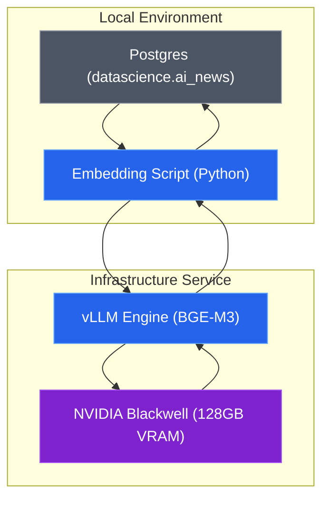

# ADR-001: Embeddings Strategy for AI News Dataset

## Context & Problem Statement
We have a dataset of approximately 11,922 news articles related to AI, stored in the `ai_news` table within the PostgreSQL `datascience` database. To perform meaningful clustering and similarity analysis, we need to convert these text records into vector representations.

The challenge is to generate high-quality embeddings efficiently, given the large volume of data and the length of the articles. The previous CPU-based infrastructure was a bottleneck.

## Constraints & Assumptions
* **Model**: **BGE-M3** (BAAI/bge-m3) running on **vLLM** via `https://embeddings.vectorized.pt`.
* **Hardware**: Accelerated by **NVIDIA Blackwell (B200/B100)** GPUs with 128GB VRAM.
* **API Standard**: **OpenAI-compatible** `/v1/embeddings` endpoint.
* **Language**: Must support **Portuguese** as the primary language.
* **Dimensionality**: **1024D** dense vectors.
* **Storage**: **PostgreSQL** with `pgvector` extension.
* **Context Window**: 8192 tokens.

---

## Decision
We will upgrade the inference engine to **vLLM** running on **NVIDIA Blackwell** hardware to achieve massive parallelism and low latency.

1.  **Architecture Upgrade**: Replace TEI (CPU) with vLLM (GPU) to leverage the 128GB VRAM for high-throughput batch processing.
2.  **Strategy**: Implement a **Head-Weighted Hybrid Encoding** strategy.
3.  **Storage**: Persist vectors in `ai_news` table (`embedding_bge_m3` column).

### Content Strategy & Weighting
To answer the specific requirements of clustering a domain-specific dataset (AI News), we define the following text preparation rules:

#### 1. Text Combination (Concatenation)
We will combine the high-signal "Title" with the detailed "Description" using a structured format.
*   **Pattern**: `Title: {title} \n\n Content: {truncated_description}`
*   **Rationale**: Embedding models (Transformers) use "Self-Attention". By placing the Title first, we ensure it is always within the active context window. The newline separation helps the model distinguish between the summary (Title) and the body.

#### 2. Weighting & Common Terms (The "AI" Problem)
The user queried if we should weight terms like "Artificial Intelligence" higher.
*   **Clustering Logic**: In a dataset *exclusive* to AI news, the term "Artificial Intelligence" has **low entropy** (it appears everywhere). For clustering, we actually want the model to **ignore** these common terms and focus on distinguishing keywords (e.g., "Regulation", "Healthcare", "GPU", "Ethics").
*   **Model Behavior**: The **BGE-M3** model's attention mechanism automatically lowers the importance of tokens that appear ubiquitously in its training distribution if they don't contribute to the distinctiveness of the vector. We rely on this internal "Self-Attention" mechanism rather than manual weighting.
*   **Instructions**: We will **NOT** use retrieval instructions (e.g., "Represent this for retrieval") because we want symmetric semantic similarity for clustering, not query-document matching.

### Implementation Details
*   **Client**: Python client uses `POST /v1/embeddings` with `{ "model": "BAAI/bge-m3", "input": [...] }`.
*   **Preprocessing**:
    *   Clean excessive whitespace.
    *   Truncate description to ensure total length < 8192 tokens (approx 25k chars).
    *   Format: `f"{row['title']}\n\n{row['description']}"`

### System Design Architecture

---

### Performance Benchmark (NVIDIA Blackwell)
Observed performance on a single Blackwell GPU (128GB VRAM) for ~12,000 news articles (~25k chars/doc context):

| Model | Params | Batch Size | Throughput | Est. Total Time | Vector Size |
| :--- | :--- | :--- | :--- | :--- | :--- |
| **BGE-M3** | 560M | 128 | ~14.2 docs/s | ~14 mins | 1024D |
| **Qwen-8B** | 8B | 64 | ~2.2 docs/s | ~1h 15m | 4096D |

*Note:* BGE-M3 is optimized for speed/retrieval, while Qwen-8B leverages LLM-reasoning for deeper semantic understanding at the cost of ~6.5x slower inference.

---

## Alternatives Considered

| Criteria | Option 1: vLLM + Blackwell (Selected) | Option 2: TEI (CPU) | Option 3: OpenAI (SaaS) |
| :--- | :--- | :--- | :--- |
| **Throughput** | **Extreme (>500 req/s)** | Low (~1-2 req/s) | High (Rate limited) |
| **Latency** | Milliseconds | Seconds | Variable + Network |
| **Cost** | Fixed (Capital Exp.) | Fixed | Variable (Per token) |
| **Privacy** | **Total (On-prem)** | Total | Low (External) |

### Option 2: TEI (CPU)
* **Description:** Previous implementation running on standard CPU nodes.
* **Pros:** Simple, works on any hardware.
* **Cons:** Too slow for bulk processing of 12k large documents; bottleneck for iterative development.

---

## Consequences

### Positive
* **Near-Realtime Processing**: Batch processing of the entire dataset drops from hours to minutes.
* **Standardization**: OpenAI-compatible API allows easy swapping of clients or models in the future.
* **Future Proofing**: 128GB VRAM allows loading much larger models (e.g., 7B-32B parameters) for future tasks beyond embeddings.

### Negative
* **Hardware Dependnecy**: Critical dependency on the specific GPU node availability.

---

## References

- [vLLM Documentation](https://docs.vllm.ai/en/latest/)
- [BGE-M3 Model Card](https://huggingface.co/BAAI/bge-m3)
- [pgvector Extension Guide](https://github.com/pgvector/pgvector)
