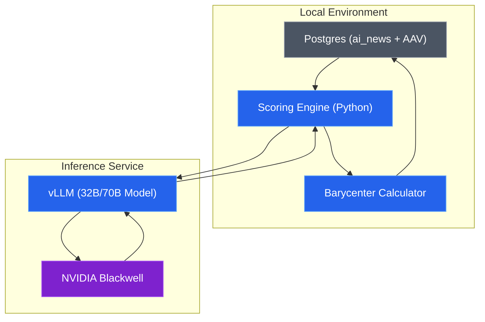
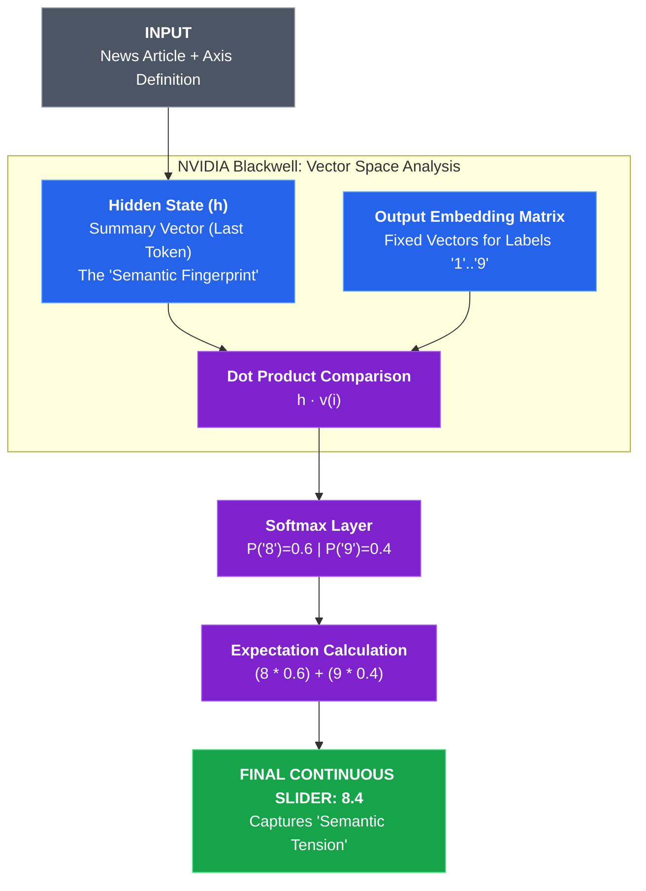

# ADR-002: Semantic Dimension Mapping (The Physics of Attention)

## Context & Problem Statement
Following the "Physics of Public Attention" framework (see `notes/paper-exploration.md`), we need to move beyond static clustering. The goal is to establish a **Fixed Semantic Canvas** where clusters are not just groups, but territories with measurable properties. 

To visualize how the "Center of Mass" of Portuguese media discourse shifts under regulatory shocks (like the AI Act), we need to project news articles onto intelligible semantic axes (Sliders).

## Constraints & Assumptions
* **Models**: **Qwen2.5-72B-Instruct** (High-Fidelity) and **Qwen2.5-7B-Instruct** (Baseline).
* **Metric**: Zero-shot probabilistic scoring (Logit Lens) for each axis.
* **Weighting**: All semantic scores must be compatible with **AAV (Advertising Value Equivalency)** to calculate the **Media Barycenter**.

---

## Decision
We will implement a multi-dimensional "Scoring Engine" that transforms text into a vector of dialectic sliders.

### 1. The Semantic Sliders (0.0 to 1.0)
Each news item will be scored on the following expanded axes:

| Axis / Slider | 0.0 (Min) | 1.0 (Max) |
| :--- | :--- | :--- |
| **Opportunity vs. Risk** | Pure Hype / Gain | Pure Fear / Danger |
| **Regulatory Pressure** | Deregulation / Free Market | High Regulation / Compliance |
| **Economic Momentum** | Niche / Non-profit | High Investment / Commercial |
| **Ethics vs. Utility** | Rights / Human-centric | Performance / Efficiency |
| **Technical Depth** | Pop Culture / Generalist | Specialized / Technical |
| **Geopolitical Scope** | Local / Portugal / EU | Global / US / China |
| **Urgency / Sentiment**| Analytical / Educational | Alarmist / Breaking News |

### 2. The Media Barycenter Calculation
We will use these sliders to calculate the **Center of Attention ($\vec{C}_t$)** over time:

$$
\vec{C}_t = \frac{\sum_{i=1}^{n} (\text{Slider}_i \cdot AAV_i)}{\sum_{i=1}^{n} AAV_i}
$$

This allows us to track if the "weight" of the discourse is moving towards "Risk" or "Regulation" during specific time windows.

### 3. Implementation Details
*   **Engine**: vLLM with JSON mode to ensure valid float outputs.
*   **Prompting**: A "Dialectic Dictionary" prompt that defines the 0.0 and 1.0 anchors for each slider to minimize model drift.
*   **Scale**: Batch processing across the 12k articles using the Blackwell GPU to handle the heavy LLM inference.

### System Design Architecture

---

## Alternatives Considered

| Criteria | Option 1: Large LLM Zero-Shot (Selected) | Option 2: Small BERT Classifier | Option 3: Keyword/Dictionary |
| :--- | :--- | :--- | :--- |
| **Flexibility** | **Very High (Change labels by prompt)** | Low (Requires re-training) | Medium (Manual tuning) |
| **Nuance** | **High (Contextual)** | Medium | Low |
| **Effort** | Low (Prompting only) | High (Needs labeled data) | Medium |
| **Verdict** | **Best for discovery** | Rejected (Manual labeling cost) | Rejected (Too rigid) |

---

## Consequences

### Positive
*   **Intelligibility**: Clusters become explainable (e.g., "This cluster is 80% Opportunity and 70% Investment").
*   **Versatility**: We can add new dimensions (e.g., "Ethics", "Geopolitics") simply by updating the prompt.
*   **Visualization**: Enables "Semantic Heatmaps" of the news landscape.

### Negative
*   **Inference Cost**: Processing 12k news with a 32B/70B model is slower than embeddings.
*   **Stochasticity**: Scores may vary slightly between runs (mitigated by setting `temperature=0`).

### Risks & Mitigations
*   **Risk**: Model hallucinations in scoring.
*   **Mitigation**: Provide the LLM with "Anchor Examples" in the system prompt (Few-shot) to calibrate what constitutes a 0.1 vs a 0.9.

### 4. Technical Implementation: Vector Proximity (Dot Product Scoring)
To ensure maximum speed and scientific rigor, we bypass text generation by directly querying the model's **Unembedding Layer**. This method treats the LLM as a high-dimensional measuring tool rather than a text generator.

#### The Mechanics: From Hidden States to Sliders
1.  **Summary Vector (Hidden State)**: After processing the news article and prompt, the Transformer's self-attention layers condense the information into a single high-dimensional vector: the **Hidden State ($h$)** of the last token. This vector is the "semantic fingerprint" of the article under the lens of our query.
2.  **The Output Matrix (Unembedding)**: The model has a fixed matrix $W_{out}$ containing the vector representation of all tokens (including numbers '1' through '9').
3.  **Vector Proximity (Dot Product)**: We calculate the proximity (dot product) between our article's hidden state $h$ and the vectors of our target labels $\{v_1, v_2, ..., v_9\}$.
    $$ \text{Logit}_i = h \cdot v_i $$
4.  **Softmax Distribution**: These raw proximity scores are passed through a Softmax layer to create a probability distribution that sums to 1.0. 
5.  **Expectation (The Slider)**: Instead of choosing the "winning" token, we calculate the **Expected Value ($E[x]$)**, which provides a continuous decimal score (e.g., 8.4) that captures the model's nuanced "hesitation" between two concepts.

#### Visualizing the Transformer "Measurement"
The diagram below shows how the news article is "projected" into the specific labels we define.

---

## Alternatives Considered

| Criteria | Option 1: Vector Proximity (Selected) | Option 2: JSON Generation | Option 3: BERT-Classifier |
| :--- | :--- | :--- | :--- |
| **Precision** | **High (Continuous/Decimal)** | Medium (Discrete Integer) | Medium |
| **Speed** | **Fast (1 inference pass)** | Slow (10-20 passes) | Fast |
| **Complexity** | Technical but robust | Simple | High (Needs training) |
| **Verdict** | **Best for large-scale analysis** | Rejected (Latency) | Rejected (Bias-prone) |

---

## Consequences

### Positive
*   **Scientific Rigor**: Moves the "Eval" from anecdotal text to measurable vector proximity.
*   **Efficiency**: Processes the 12k records in minutes, not hours, on the Blackwell.
*   **Precision**: Captures the "Semantic Tension" (hesitation) between labels, allowing for much smoother data visualizations.

### 5. A/B Testing Strategy (The Logic of Comparison)
To validate the reliability of automated scoring, we maintain a multi-model data schema. 

#### Data Storage & Namespacing
Instead of adding model prefixes to each column (e.g., `qwen_s_reg`), we use a **Single-Table, Composite-Key** approach in the `ai_news_semantics` table.
*   **Primary Key**: `(guid, model_name)`
*   **Logic**: This allows us to store the exact same article scored by different models (e.g., `Qwen2.5-7B` vs `DeepSeek-V3.1`) as separate rows.
*   **Analysis**: This structure simplifies A/B testing via standard SQL `JOIN` or `WHERE model_name = '...'`, enabling direct correlation analysis between model sizes.

#### Evaluation Benchmarks
1.  **Model Agreement**: Measure the Delta ($\Delta$) between the smaller model (7B/14B) and the larger reasoning-class models (DeepSeek-V3/Llama-70B) across the 12,000 documents.
2.  **Gold Standard**: Manually verify a random sample of 100 articles to calibrate the "Decimal Tension" against human perception.

---

## References

- [vLLM Logprobs Documentation](https://docs.vllm.ai/en/latest/serving/openai_compatible_server.html)
- [Zero-Shot Classification via Log-Likelihood (ArXiv:2104.14690)](https://arxiv.org/abs/2104.14690)
- [The 'Logit Lens' for Transformer Interpretability](https://www.lesswrong.com/posts/AcKRB8wLia3JaZbaM/the-logit-lens)
- [Physics of Public Attention Framework (Internal)](notes/paper-exploration.md)
