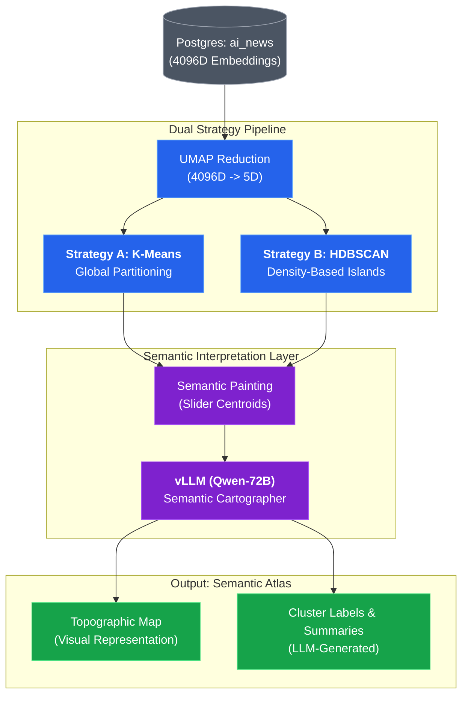

# ADR-003: Topographic Clustering & Semantic Painting

## Context & Problem Statement
We have successfully generated high-dimensional embeddings (Qwen-8B, 4096D) and multi-dimensional semantic scores (7 Sliders) for ~12,000 articles. 
The current challenge is to organize this "ocean" of data into a coherent **Topographic Map**. 
We need to distinguish between **Spatial Analysis** (where ideas sit in relation to each other) and **Temporal Analysis** (how they move over time). To avoid confusion, we will focus exclusively on the static topography first.

## Constraints & Assumptions
* **Constraint 1**: Must handle high-density clusters and noise (outliers).
* **Constraint 2**: Separation of Concerns: Spatial topography must be documented and validated before time-series analysis begins.
* **Assumption**: News topics naturally aggregate into "Islands" (Clusters) with varying densities.

---

## Decision
We will implement a **Multi-Strategy Topographic Mapping** process to provide a comparative analysis (Evaluation Benchmarking) between two fundamental clustering philosophies:

1.  **Global Partitioning (Baseline: K-Means)**:
    *   **Logic**: Divides the entire semantic space into exactly $K$ Voronoi cells.
    *   **Goal**: Provide a "Total Coverage" map where every article belongs to a category.
    *   **Eval Value**: Acts as a sanity check for cluster stability.

2.  **Topological Density (Advanced: UMAP + HDBSCAN)**:
    *   **Logic**: Discovers "Islands" based on information density, ignoring "Sea" (Noise).
    *   **Goal**: Identify highly-coherent niche topics and discourse hubs.
    *   **Eval Value**: Superior for discovering nuanced discourse dynamics that K-Means might blur.

### Technical Implementation

#### 1. Geometric Backbone
*   **Dimensionality Reduction**: UMAP will be used for both strategies to project the 4096D (Qwen-8B) vectors into a more manageable 5D space for clustering.
*   **Strategy A (K-Means)**: Elbow method or Silhouette score to determine $K$.
*   **Strategy B (HDBSCAN)**: Parameter tuning for `min_cluster_size` to define the "granularity" of the islands.

#### 2. Semantic Painting (The Comparative Eval)
Both models will be projected onto the **Slider Matrix** (the 7 semantic axes). We will compare:
*   **Cluster Purity**: How well the Slider Centroid of a cluster represents its members.
*   **Topographic Agreement**: Do both models agree on the core "Investment" or "Regulation" hubs?

#### 3. LLM-Assisted Interpretation & Validation
To bridge the gap between "Geometric Points" and "Human Meaning", we will use a Large Language Model (e.g., Qwen-72B-Instruct via vLLM) as a **Semantic Cartographer**:
*   **Topic Synthesis**: We feed the top N articles (closest to centroid) and the slider signatures of a cluster to the LLM to generate a natural language title and a 2-sentence summary of the "Island".
*   **Coherence Validation**: The LLM acts as a judge, identifying "intruder" news items within clusters to measure topographic precision.
*   **Context Extraction**: Uses pre-computed `ai_context_snippets` (ADR-006) for efficient and consistent article context, avoiding on-the-fly regex extraction.

**Semantic Painting Workflow (Micro-Architecture)**:

```mermaid
sequenceDiagram
    participant P as 🖌️ Semantic Painter<br/>(Python Client)
    participant DB as 🐘 Postgres<br/>(Topography Data)
    participant LLM as 🧠 vLLM Service<br/>(Qwen-72B)
    participant META as 🗃️ Metadata Table

    Note over P: Start Labeling Loop

    P->>DB: 1. Get Cluster IDs & Sizes
    DB-->>P: List [0, 1, 42, ...]

    loop For Each Cluster
        P->>DB: 2. Fetch Headlines + Slider Profile<br/>(Avg Scores for Cluster)
        DB-->>P: Titles [...] + Scores {Catastrophic: 0.8, ...}
        
        Note right of P: Construct Prompt:<br/>"Topic with these Titles<br/>AND this Emotional Profile?"

        P->>LLM: 3. POST /v1/chat/completions
        LLM-->>P: 4. Returns JSON:<br/>{ "label": "AI Doomerism", "summary": "High catastrophic scores..." }

        P->>META: 5. Upsert Metadata<br/>(Cluster ID + Label + Summary)
    end
``` 

### System Design Architecture

---

## Alternatives Considered

| Criteria | Option 1: K-Means (Baseline) | Option 2: HDBSCAN (Target) |
| :--- | :--- | :--- |
| **Philosophy** | **Centroid-based (Partition)** | **Density-based (Topology)** |
| **Noise Handling** | Forces noise into clusters | Tags noise as "-1" (Outliers) |
| **Scalability** | O(n) - Very Fast | O(n log n) - Fast |
| **Cluster Shape** | Assumes Spherical | Can find arbitrary shapes |
| **Academic Value** | Standard industry benchmark | State-of-the-art for NLP |

---

## Consequences

### Positive
*   **Evaluation Rigor**: Comparing two distinct algorithms makes the research significantly more robust for the Thesis/Eval.
*   **Methodological Transparency**: Highlights why a density-based approach might be better for media analysis than simple partitioning.
*   **Visual Richness**: Allows for "Side-by-Side" maps in the final presentation.

### Negative
* **Computational Cost**: UMAP and HDBSCAN on 12k records is light on Blackwell but requires careful parameter tuning (`min_cluster_size`).
* **Cluster Fragility**: Small changes in parameters can merge or split "islands".

---

## References

- [UMAP Documentation](https://umap-learn.readthedocs.io/)
- [HDBSCAN: Density-Based Clustering](https://hdbscan.readthedocs.io/)
- [Semantic Topography in Journalism (Internal Research)](notes/paper-exploration.md)
