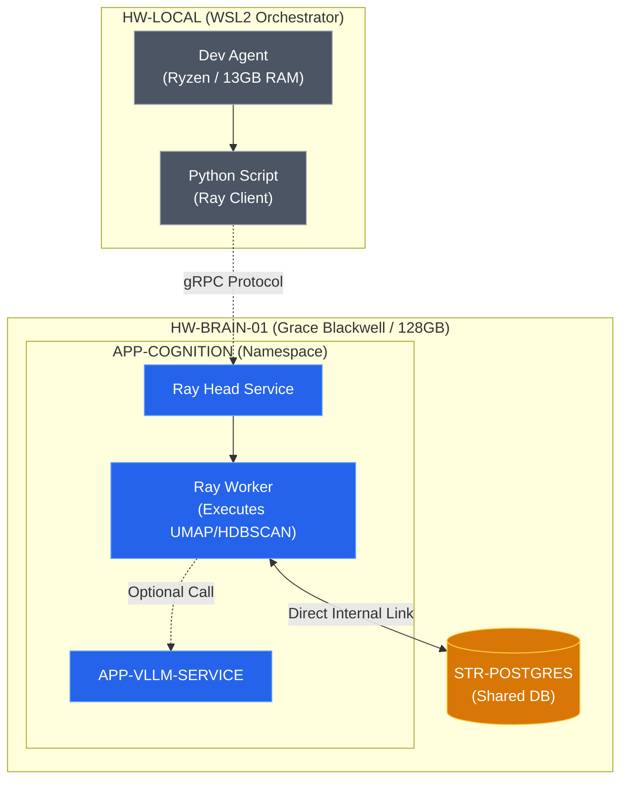

# ADR-004: Server-Side Compute Offloading Pattern (Beyond vLLM)

## Context & Problem Statement
Our local dev environment (running on Ryzen 7 / 13GB RAM) act as the orchestrator but is hardware-constrained for heavy data science. While sufficient for small scripts, it consistently fails (OOM-Killer) when attempting high-dimensional operations like UMAP reduction on 12,000 objects with 4096D embeddings.

The cluster infrastructure provides **HW-BRAIN-01** (NVIDIA GB10 Grace Blackwell) with **128GB Unified Memory**, designed specifically for these workloads. We need to formalize the offloading of heavy compute from the local Control Plane to the **APP-COGNITION** namespace.

## Constraints & Assumptions
* **Constraint 1 (NET)**: No direct port forwarding for heavy data transfers. Must use `POSTGRES_URL_INTERNAL` within the cluster.
* **Constraint 2 (HW)**: Heavy tasks must be affinity-targeted to **HW-BRAIN-01** to leverage the Grace Blackwell memory architecture.
* **Assumption**: Containerized jobs are the standard medium for non-persistent compute offloading.

---

## Decision
We will adopt **Ray Distributed Runtime** as the standard pattern for offloading non-vLLM compute tasks (UMAP, HDBSCAN, batch-processing) to the high-performance node.

### Pattern: The "Transparent Offload" (Ray)
Instead of writing Kubernetes manifests (jobs) for every task, we treat the cluster as a remote Python Kernel.

1.  **Ray Cluster**: A persistent Ray deployment (Head + Workers) runs on **HW-BRAIN-01** (Namespace: `APP-COGNITION`).
2.  **Client-Side**: Local Python scripts use `ray.init("ray://...")` to connect to the cluster.
3.  **Execution**: Functions decorated with `@ray.remote` are serialized and executed on the Blackwell node, with full access to its 128GB RAM and GPU.
4.  **Database Access**: Remote functions use `POSTGRES_URL_INTERNAL` to write results directly to `STR-POSTGRES`.

### System Design Architecture

---

## Alternatives Considered

| Criteria | Option 1: Ray (Selected) | Option 2: Kubernetes Jobs | Option 3: Local Execution |
| :--- | :--- | :--- | :--- |
| **Automation** | **High** (Python-native) | Medium (YAML-heavy) | Low (Manual) |
| **Developer Exp.** | **Excellent** (Transparent) | Poor (Context Switching) | Standard |
| **Hardware Access** | **Dynamic** (On-demand) | Static (Job Spec) | Constrained (Local) |
| **Verdict** | **Adopted for agility** | Fallback for long-running batches | Rejected (Hardware limits) |

---

## Consequences

### Positive
*   **Infinite Scale**: We are no longer limited by the local machine's RAM.
*   **GPU Acceleration**: Enables future use of RAPIDS (cuML) to run clustering on NVIDIA Blackwell, reducing time from minutes to milliseconds.
*   **Database Proximity**: Zero latencies for heavy read/write operations.

### Negative
*   **Feedback Loop Delay**: Requires a container build/push cycle if dependencies change (mitigated by using a generic "all-in-one" dev image).
*   **Complexity**: Adds Kubernetes manifest management to the workflow.

---

## References

- [Kubernetes Jobs Documentation](https://kubernetes.io/docs/concepts/workloads/controllers/job/)
- [NVIDIA RAPIDS (cuML) for GPU Data Science](https://docs.rapids.ai/api/cuml/stable/)
- [Grace Blackwell Memory Architecture](https://www.nvidia.com/en-us/data-center/grace-blackwell-superchip/)
