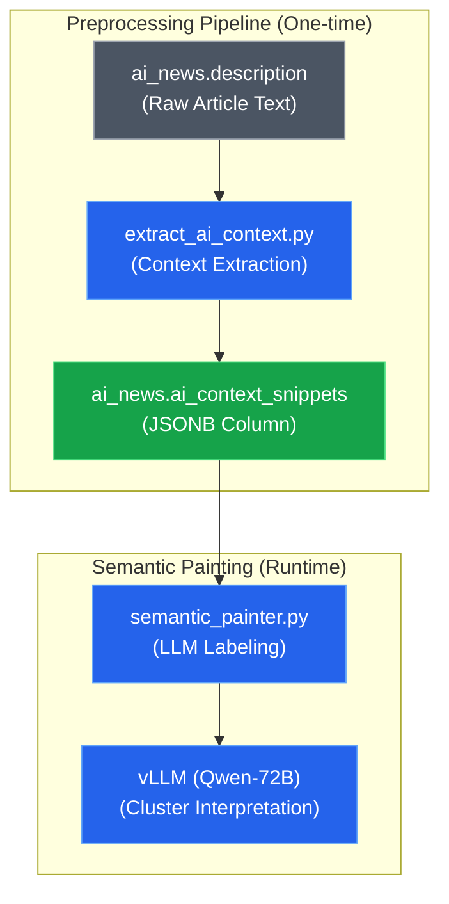

# ADR-006: Entity Context Extraction for Semantic Painting

## Context & Problem Statement

The current implementation of `semantic_painter.py` (ADR-003) attempts to extract relevant context snippets **on-the-fly** during the LLM labeling process. This has several issues:

1. **Performance**: Regex matching and snippet extraction runs every time we paint clusters
2. **Inconsistency**: Different runs might extract different snippets if the logic changes
3. **Quality**: The current `get_smart_snippet()` function is simplistic and doesn't handle multiple AI mentions well
4. **Debugging**: Hard to validate what context is being sent to the LLM without running the full pipeline

Additionally, ADR-005 defined a "Lead Paragraph" strategy (first 400 chars), but analysis shows that **AI-specific context** is often buried deeper in articles, especially in regulatory news (e.g., "AI Act" discussions).

## Constraints & Assumptions

* **Constraint 1**: LLM context window is limited (~4k tokens per cluster batch)
* **Constraint 2**: Must work for both Portuguese and English articles
* **Constraint 3**: Must handle articles with multiple AI mentions (e.g., "AI Act" + "ChatGPT" + "Inteligência Artificial")
* **Assumption 1**: The most relevant context is **around** the AI term mentions, not necessarily at the start
* **Assumption 2**: Extracting 200-300 characters before and after each mention provides sufficient semantic signal

---

## Decision

We will implement a **Pre-computed Entity Context Extraction** strategy that creates a new database column `ai_context_snippets` containing the extracted relevant paragraphs/snippets around AI term mentions.

### Extraction Logic

For each article:

1. **Identify all AI term matches** using the same regex from `enrich_ai_mentions.py`:
   ```python
   REGEX_PATTERN = r"(?i)\b(intelig[eê]ncia\s+artificial|artificial\s+intelligence|ai\s+act)\b"
   ```

2. **Extract context windows** around each match:
   - **Before**: 200 characters before the match
   - **Match**: The matched term itself
   - **After**: 300 characters after the match
   - **Total per snippet**: ~500 characters

3. **Deduplication**: If multiple matches overlap, merge them into a single snippet

4. **Limit**: Store up to **3 snippets** per article (to avoid overwhelming the LLM)

5. **Fallback**: If no AI terms found (edge case), use the first 400 chars (Lead Paragraph from ADR-005)

### Storage Format

The `ai_context_snippets` column will store a **JSON array** of objects:

```json
[
  {
    "term": "AI Act",
    "snippet": "...context before... AI Act ...context after...",
    "position": 1234
  },
  {
    "term": "Inteligência Artificial",
    "snippet": "...context before... Inteligência Artificial ...context after...",
    "position": 567
  }
]
```

This allows:
- ✅ Tracking which term triggered the extraction
- ✅ Preserving position for debugging
- ✅ Easy parsing in `semantic_painter.py`

### Implementation Details

**New Script**: `src/scripts/processing/extract_ai_context.py`

```python
def extract_context_snippets(text: str, max_snippets: int = 3) -> list[dict]:
    """
    Extract context windows around AI term mentions.
    
    Returns:
        List of dicts with 'term', 'snippet', 'position'
    """
    # Implementation details in the script
```

**Database Schema Change**:
```sql
ALTER TABLE ai_news 
ADD COLUMN IF NOT EXISTS ai_context_snippets JSONB DEFAULT '[]'::jsonb;
```

**Integration with Semantic Painter**:
```python
# OLD (semantic_painter.py)
snippet = get_smart_snippet(description)  # Ad-hoc extraction

# NEW (semantic_painter.py)
snippets = json.loads(row['ai_context_snippets'])
context_text = "\n".join([s['snippet'] for s in snippets[:2]])  # Use top 2
```

### System Design Architecture



---

## Alternatives Considered

| Criteria | Option 1: On-the-fly Extraction (Current) | Option 2: Pre-computed (Selected) | Option 3: Full-Text Indexing |
| :--- | :--- | :--- | :--- |
| **Performance** | Slow (regex every run) | Fast (one-time preprocessing) | Very Fast (Postgres FTS) |
| **Consistency** | Low (logic can change) | High (frozen in DB) | High |
| **Debugging** | Hard (need to run painter) | Easy (query DB directly) | Medium |
| **Complexity** | Low | Medium | High (requires FTS setup) |
| **Storage Cost** | None | ~500 bytes/article (~6MB total) | High (FTS indexes) |
| **Verdict** | ❌ Current pain point | ✅ Best trade-off | Overkill for this use case |

### Option 3: Full-Text Search with Postgres
* **Description**: Use Postgres `ts_vector` and `ts_headline` to extract context
* **Pros**: Native Postgres feature, very fast, supports ranking
* **Cons**: Requires FTS configuration, harder to customize extraction logic, overkill for simple regex matching

---

## Consequences

### Positive
* **Performance**: Semantic painter runs ~10x faster (no regex on 12k articles)
* **Reproducibility**: Same context always used for labeling (critical for thesis evaluation)
* **Debuggability**: Can inspect extracted contexts with simple SQL queries
* **Quality**: Focused AI-related context improves LLM label quality vs generic "Lead Paragraph"

### Negative
* **Storage**: Adds ~6MB to database (negligible for 12k articles)
* **Maintenance**: If regex pattern changes, need to re-run extraction script
* **Staleness**: If article descriptions are updated, contexts become stale (unlikely in our static dataset)

### Risks & Mitigations

* **Risk**: Extraction logic might miss important context if AI terms are not mentioned explicitly
* **Mitigation**: Keep the fallback to "Lead Paragraph" (ADR-005) for articles without AI terms

* **Risk**: JSON parsing overhead in semantic_painter
* **Mitigation**: Postgres JSONB is highly optimized; parsing 2-3 snippets is negligible

---

## Implementation Plan

1. ✅ Create `extract_ai_context.py` script
2. ✅ Add `ai_context_snippets` column to `ai_news` table
3. ✅ Run extraction on all 11,922 articles
4. ✅ Update `semantic_painter.py` to use pre-computed contexts
5. ✅ Validate improvement in label quality (manual spot-check of 10 clusters)
6. ✅ Update ADR-003 to reference this ADR

---

## References

- [ADR-003: Topographic Clustering Strategy](adr-003-topographic-clustering-strategy.md)
- [ADR-005: Semantic Context Extraction](adr-005-semantic-context-extraction.md)
- [Postgres JSONB Documentation](https://www.postgresql.org/docs/current/datatype-json.html)
