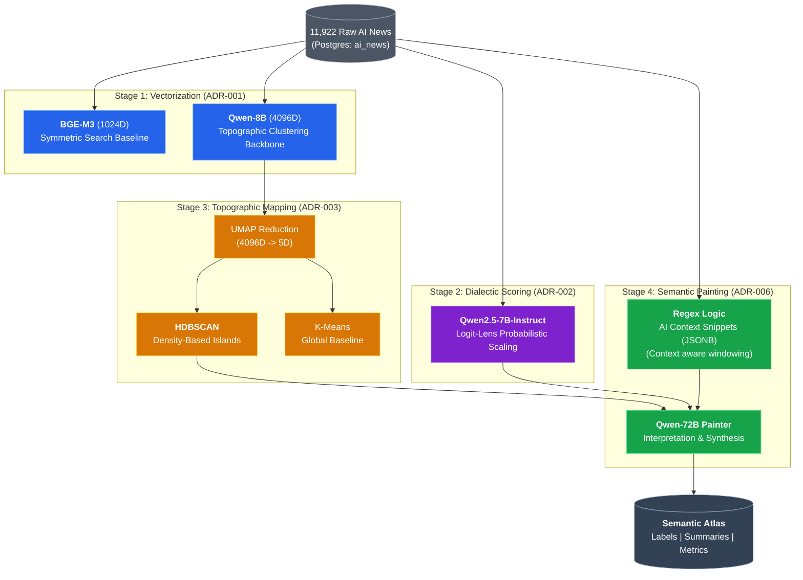

# ADR-010: End-to-End Semantic Atlas Pipeline

## Context & Problem Statement
We have successfully implemented several modules for analyzing ~12,000 Portuguese AI news articles. To ensure scientific reproducibility and technical clarity for the final system, we need a single master document that captures the definitive state of the end-to-end pipeline.

The pipeline transforms raw news text into a structured "Semantic Atlas" composed of topographic islands, each defined by a multidimensional profile and a natural language interpretation.

## Constraints & Assumptions
*   **Hardware**: **NVIDIA Blackwell (B200/B100)** is the primary compute engine.
*   **Database**: **PostgreSQL** with `pgvector` and `JSONB` support.
*   **Framework**: `uv` for python workspace management and vLLM for high-throughput inference.

---

## Decision: The 4-Stage Atlas Pipeline

We have established the following definitive stages for the semantic atlas construction:

### Stage 1: Dual-Model Embeddings (ADR-001)
We use two distinct models to capture different "resolutions" of meaning:
1.  **BGE-M3 (BAAI/bge-m3)**: 1024D dense vectors. Optimized for high-throughput baseline tasks and semantic similarity via a symmetric attention mechanism.
2.  **Qwen-8B (Qwen2-7B-Instruct-based)**: 4096D dense vectors. Used for high-fidelity clustering as it leverages LLM-scale world knowledge for deeper semantic grouping.

### Stage 2: Semantic Dimension Mapping (ADR-002)
Articles are projected onto 7 dialectic axes (Sliders) to calculate the "Media Barycenter":
*   **Dimensions**: Opportunity vs. Risk, Regulatory Pressure, Economic Momentum, Ethics vs. Utility, Technical Depth, Geopolitical Scope, Urgency.
*   **Model**: **Qwen2.5-7B-Instruct**.
*   **Technique**: **Vector Proximity / Logit Lens**. Instead of slow text generation, we compute the expected value of the model's unembedding logits for digits 1-9 to get precise continuous scores (0.0 - 1.0).

### Stage 3: Topographic Clustering & Reduction (ADR-003)
We convert high-dimensional semantic space into a map:
*   **Reduction**: UMAP projects 4096D (Qwen-8B) vectors into a **5D latent space**.
*   **Strategies**:
    *   **Baseline**: K-Means for global Voronoi partitioning (Total Coverage).
    *   **Primary**: **HDBSCAN** for density-based "Islands". This strategy identifies cohesive hubs of discourse while filtering "Noise" (Outliers).
*   **Target for Painting**: **HDBSCAN** clusters are the target for interpretation.

### Stage 4: Semantic Painting & Context (ADR-005/006)
The transformation from "Geometric points" to "Human Meaning":
*   **Entity Context**: A dedicated column `ai_context_snippets` (JSONB) stores pre-computed 500-character windows around AI terms (AI Act, Inteligência Artificial, etc.).
*   **Fallback**: Uses the first 400 chars (Lead Paragraph) if no explicit AI terms are found.
*   **Painter/Interpreter**: **Qwen-72B** (`mesolitica/Qwen2.5-72B-Instruct-FP8`) via vLLM. Interprets the top representatives of each **HDBSCAN** cluster using titles, snippets, and average cluster slider profiles.

---

## System Design Architecture

---

## Technical Focus: AI Context Snippet Extraction (ADR-006)

To ensure the **Qwen-72B Painter** has the highest quality signal, we developed a specialized context extraction layer. Instead of simple lead-paragraph truncation, we target the specific mentions of AI entities.

### Extraction Mechanics
The process follows a "Window & Merge" logic to capture semantic surround:

1.  **Entity Detection**: A case-insensitive regex targets core terms:
    *   `inteligência artificial` / `artificial intelligence`
    *   `ai act`
2.  **Windowing**: For every match, we extract:
    *   **200 tokens before** the mention (provides premise/context).
    *   **300 tokens after** the mention (provides consequence/detail).
3.  **Deduplication (Merge)**: If windows overlap (e.g., "AI" mentioned twice in the same paragraph), the system clusters them into a single continuous block.
4.  **Ranking & Storage**: We limit the output to the **top 3 snippets** per article, stored in a structured `JSONB` column in Postgres.

### Visualizing the Context Window

---

## Consequences

### Positive
*   **Scientific Rigor**: The use of Logit Lens (Stage 2) and Density-based clustering (Stage 3) ensures a higher degree of analytical precision than traditional NLP pipelines.
*   **Efficiency**: Blackwell hardware minimizes the latency of the Stage 4 interpretation, allowing for rapid iterations on the 119 islands.
*   **Explainability**: Every island is described not just by text, but by its coordinates on the 7-dimensional semantic canvas.

### Negative
*   **Hardware Lock-in**: The pipeline is heavily optimized for Blackwell/vLLM. Running on smaller hardware would require significant model quantization.
*   **Complexity**: Integration of JSONB metadata, Vector columns, and AAV scores requires a robust database manager.

---

## References
- [ADR-001: Embeddings Strategy](ADR-001-embeddings-strategy.md)
- [ADR-002: Semantic Mapping](ADR-002-semantic-dimensions-mapping.md)
- [ADR-003: Topographic Strategy](ADR-003-topographic-clustering-strategy.md)
- [ADR-006: Context Extraction](ADR-006-entity-context-extraction.md)
