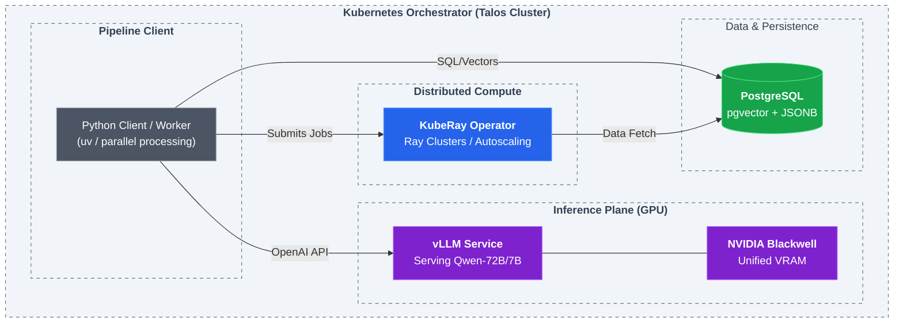
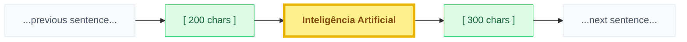
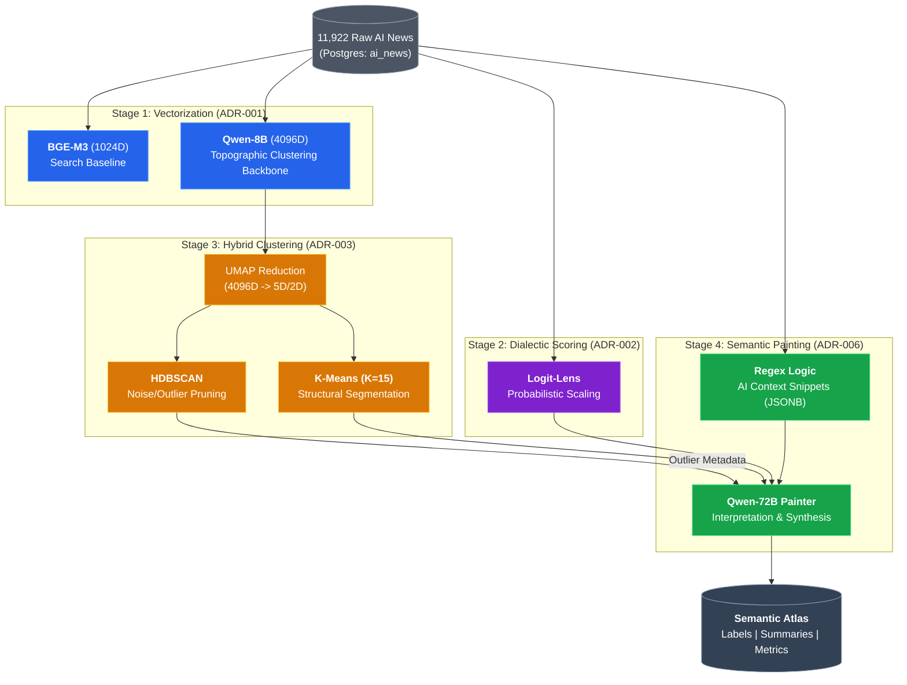
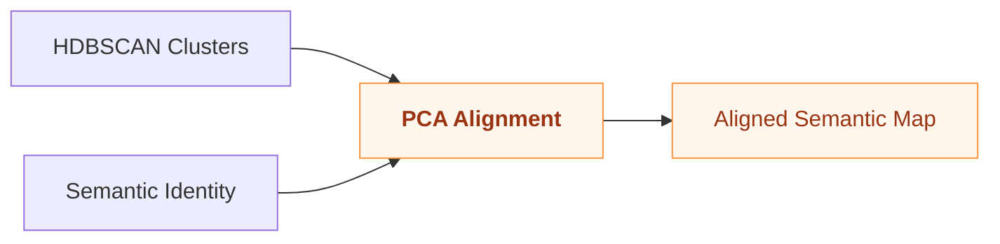

# ADR-010: End-to-End Semantic Atlas Pipeline

## Context & Problem Statement
We have successfully implemented several modules for analyzing ~12,000 Portuguese AI news articles. To ensure scientific reproducibility and technical clarity for the final system, we need a single master document that captures the definitive state of the end-to-end pipeline.

The pipeline transforms raw news text into a structured "Semantic Atlas" composed of topographic islands, each defined by a multidimensional profile and a natural language interpretation.

## Constraints & Assumptions
*   **Hardware**: **NVIDIA Blackwell (B200/B100)** is the primary compute engine.
*   **Database**: **PostgreSQL** with `pgvector` and `JSONB` support.
*   **Framework**: `uv` for python workspace management and vLLM for high-throughput inference.

---

## Infrastructure & Server-Side Stack

The pipeline is orchestrated on a high-performance Kubernetes cluster, leveraging GPU-accelerated namespaces to handle massive inference and distributed compute tasks.

### Tech Stack Components
*   **Orchestration**: **Kubernetes** (Talos Cluster) for container lifecycle management.
*   **Storage**: **PostgreSQL** with **pgvector** and **JSONB** (Datascience DB).
*   **Inference**: **vLLM** running on **NVIDIA Blackwell** (B200/B100) GPUs for high-throughput LLM tasks.
*   **Distributed Compute**: **KubeRay** for managing Ray Clusters tailored for parallel data processing (UMAP, Clustering).

### Infrastructure Topology

---

## Technical Focus: AI Context Snippet Extraction (Preprocessing)

To ensure the **Qwen-72B Painter** has the highest quality signal, we developed a specialized context extraction layer as a **mandatory preprocessing step** (ADR-006).

### Extraction Mechanics
Instead of simple lead-paragraph truncation, we target the specific mentions of AI entities using a "Window & Merge" logic:

1.  **Entity Detection**: A case-insensitive regex targets core terms (`inteligência artificial`, `ai act`).
2.  **Windowing**: For every match, we extract **200 chars before** and **300 chars after**.

### Visualizing the Context Window

---

## Decision: The 4-Stage Atlas Pipeline

We have established the following definitive stages for the semantic atlas construction:

### Stage 1: Dual-Model Embeddings (ADR-001)
We use two distinct models to capture different "resolutions" of meaning:
1.  **BGE-M3 (BAAI/bge-m3)**: 1024D dense vectors. Optimized for high-throughput baseline tasks.
2.  **Qwen-8B (Qwen2-7B-Instruct-based)**: 4096D dense vectors. Used for high-fidelity clustering.

### Stage 2: Semantic Dimension Mapping (ADR-002)
Articles are projected onto 7 dialectic axes (Sliders) using the **Logit-Lens** technique. 
*   **Model**: **Qwen2.5-72B-Instruct** (High-Fidelity) or **Qwen2.5-7B-Instruct** (Baseline).
*   **Result**: Precise continuous scores (0.0 - 1.0) per axis.

### Stage 3: Topographic Mapping & Hybrid Clustering (ADR-003)
*   **Reduction**: UMAP projects 4096D (Qwen-8B) vectors into a **5D latent space** for clustering and a **2D space** for visualization.
*   **Analysis (HDBSCAN)**: A density-based analysis identifies semantic noise and high-density cores. This serves as a diagnostic for outlier identification.
*   **Segmentation (K-Means)**: **K-Means (K=15)** is applied to provide a comprehensive structural mapping of narrative regions across the entire corpus.

### Stage 4: Semantic Painting & Interpretation
*   **Painter**: **Qwen-72B** (`mesolitica/Qwen2.5-72B-Instruct-FP8`) interprets the **K-Means** clusters using the pre-computed **Context Snippets** and average slider profiles.

---

## System Design Architecture

---

## Hypothesis 2: Semantic Manifold Alignment (Experimental)

Beyond the standard topographic discovery, we explore a second interpretation layer based on **Semantic Alignment**.

### Concept
Instead of interpreting clusters in geometric isolation, this hypothesis proposes the use of **Principal Component Analysis (PCA)** to align the **HDBSCAN Islands** with their **Semantic Identity (Logit-Lens)**.

### Workflow:
1.  **Merge**: Combine Cluster Centroids (from embeddings) with Slider Profile Averages (from LLM).
2.  **PCA Projection**: Project the combined set into a 2D/3D manifold.
3.  **Cross-Validation**: Analyze the degree of overlap between geometric proximity and semantic scoring.
4.  **Aligned Interpretation**: Use the PCA principal axes as a "Global Navigation System" for the Painter, allowing for labels that are aware of their position relative to the entire news ecosystem (e.g., "The Most Alarmist Island on the Continent").

---

## Consequences

### Positive
*   **Discovery First**: The 4-stage pipeline prioritizes finding natural patterns in the data.
*   **Hypothesis Testing**: The separate experimental section allows for scientific validation without complicating the production pipeline.

---

## References
- [ADR-001: Embeddings Strategy](ADR-001-embeddings-strategy.md)
- [ADR-002: Semantic Mapping](ADR-002-semantic-dimensions-mapping.md)
- [ADR-003: Topographic Strategy](ADR-003-topographic-clustering-strategy.md)
- [ADR-006: Context Extraction](ADR-006-entity-context-extraction.md)
