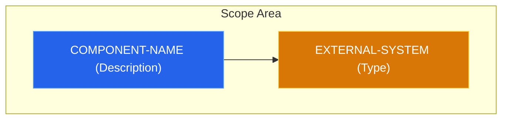

# ADR-XXX: [Decision Title]

## Context & Problem Statement
[Describe the current state of the system. What is the specific pain point or trigger that makes this decision necessary right now?]

## Constraints & Assumptions
* [Constraint 1: e.g., Must integrate with existing Auth provider]
* [Constraint 2: e.g., Budget/Time limitations]
* [Assumption: e.g., We assume traffic will not exceed X req/s]

---

## Decision
[Clearly state the chosen solution.]

### Implementation Details
[Specific technical choices, versions, or patterns to be used.]

### System Design Architecture

---

## Alternatives Considered

| Criteria | Option 1 (Selected) | Option 2 |
| :--- | :--- | :--- |
| **Effort** | Low/Medium/High | Low/Medium/High |
| **Scalability** | Scalable | Limited |
| **Verdict** | Best trade-off | Rejected due to [Reason] |

### Option 2: [Name]
* **Description:** [Briefly describe the alternative]
* **Pros:** [Advantage 1, Advantage 2]
* **Cons:** [Disadvantage 1, Disadvantage 2]

---

## Consequences

### Positive
* [Expected improvement 1]
* [Expected improvement 2]

### Negative
* [Technical debt introduced]
* [Added complexity in area X]

### Risks & Mitigations
* **Risk:** [Description of risk]
* **Mitigation:** [How to handle it]

---

## References

- [Links to documentation, issues, or relevant discussions]
