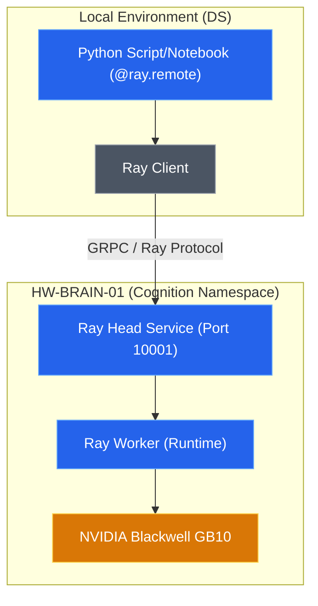

# ADR-040: Brain Node Distributed Compute Runtime

## Context & Problem Statement
Currently, performing heavy data science tasks (e.g., UMAP, large-scale clustering, model fine-tuning) on the high-performance `HW-BRAIN-01` node requires manual creation of Kubernetes Manifests (Jobs). 

For a Data Scientist, writing YAML, managing `imagePullSecrets`, and monitoring pods via `kubectl` is a high-friction workflow that detracts from the actual research. We need a "Transparent Offloading" mechanism where local Python code can run its "hot paths" on the Blackwell-powered server with minimal overhead and zero YAML management.

## Constraints & Assumptions
* **Hardware Target**: Must utilize `HW-BRAIN-01` (NVIDIA Blackwell GB10 + ARM64).
* **Environment**: Local analytics repositories should not be forced to maintain Kubernetes-specific logic.
* **Connectivity**: The developer's local machine must be able to reach the compute cluster head.
* **Assumption**: We assume Ray is suitable for the heterogeneous architecture (ARM64 on Brain Node vs potentially x86 on local machine).

---

## Decision
We will adopt **Ray** as the primary Distributed Compute Runtime for the `brain-node`. 

This choice implements the **"Remote Kernel / Compute Engine"** pattern. The Brain Node will act as a Ray Head/Worker, exposing a Ray Client endpoint.

### Implementation Details
1. **Ray Cluster Deployment**:
   - Deploy a Ray head pod on `HW-BRAIN-01` using a dedicated Kustomization in `manifests/tenants/cognition/ray/`.
   - Use the official Ray ARM64 images.
   - Configure GPU resources to allow slicing or exclusive access for Ray tasks.
2. **Connectivity**:
   - Expose the Ray Client port (default `10001`) via a Kubernetes Service.
   - Enable access for the Data Scientist via the internal network or a secure proxy.
3. **Usage Pattern**:
   - Connection: `ray.init("ray://brain-node-service:10001")`.
   - Offloading: Mark heavy functions with `@ray.remote`.

### Operations & Monitoring
We provide a helper script to manage the Brain Node compute resources:

```bash
# Check status of Ray Cluster and vLLM
./scripts/brain-compute.sh status

# Monitor resources (CPU/RAM/GPU)
./scripts/brain-compute.sh resources

# Forward ports for local development (Dashboard: http://localhost:8265)
./scripts/brain-compute.sh forward
```

### System Design Architecture


---


## Alternatives Considered

| Criteria | Option 1: Ray (Selected) | Option 2: Manual K8s Jobs | Option 3: Celery/Redis |
| :--- | :--- | :--- | :--- |
| **Effort (DS)** | Very Low (Python decorators) | High (YAML + Kubectl) | Medium (Boilerplate) |
| **Data Locality** | Managed by Ray Objects | Manual Volume Mounts | Manual Serialization |
| **Scalability** | Native / Auto-scaling | Manual | Limited to Queue Workers |
| **Verdict** | Best DX and performance | Current bottleneck | Better for async tasks, not interactive compute |

---

## Consequences

### Positive
* **Developer Experience**: Zero Kubernetes knowledge required for the DS once the cluster is up.
* **Performance**: Direct access to Blackwell GPU and high-speed RAM.
* **Lifecycle**: No more "Zombie Pods" from manual jobs; Ray manages worker lifecycles.

### Negative
* **Complexity**: Introduces another infrastructure layer (Ray) to maintain.
* **Resource Contention**: Need to ensure Ray doesn't starve `vLLM` (ADR-035) of VRAM.

### Risks & Mitigations
* **Risk**: System RAM OOM causing Node Lockup. As documented in `failure-010`, the Brain Node (HW-BRAIN-01) is highly sensitive to memory pressure. If Ray workers attempt to load models or datasets exceeding 90% of host RAM, the system may lock up.
* **Mitigation**: Enforce strict `K8s Memory Limits` on Ray Worker pods. Ray's resource scheduler must be configured to respect system memory thresholds, ensuring at least 15-20% of system RAM remains free for OS stability.
* **Risk**: ARM64 compatibility for certain Python wheels in Ray workers.
* **Mitigation**: Use controlled Docker images for Ray workers that pre-install heavy dependencies (PyTorch, JAX, etc.) optimized for Blackwell ARM64.
* **Risk**: VRAM fragmentation.
* **Mitigation**: Use `KEDA` or Ray's own resource scheduler to limit VRAM usage and integrate with existing `vLLM` resource limits.

---

## References

- [Ray Documentation: Ray Client](https://docs.ray.io/en/latest/cluster/running-applications/job-submission/ray-client.html)
- [ADR-035: vLLM Integration](services/adr-035-vllm-integration.md)
- [ADR-026: Brain Node Integration](adr-026-brain-node-integration.md)
