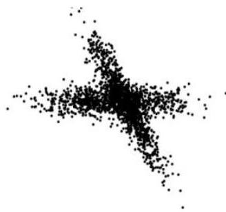

5. [0.8v] Consider class to be our ground truth, compute the purity of the clustering solution.

$$
purity = \frac{1}{4} (1 + 2) = 0.75
$$

6. [0.5v] Select the limitations of the k-Means algorithm (i.e. the true statements):

a) dependent on initialization/seeding
b) sensitive to outliers under mean centroid criteria
c) not suitable to discover clusters with irregular/non-convex shapes
d) dependent on the specification of a proper linkage criterion

7. [0.5v] Given the following data plot (right), select the proper clustering stances to recover its clusters:

a) model-based clustering
b) density-based clustering
c) soft clustering
d) hard clustering
e) partition-based clustering

8. [1v] Classify the following statements as True or False:

a) Clustering becomes semi-supervised when pairs of observations are known to belong to the same cluster. True
b) Agglomerative clustering algorithms allow to manually select a desirable number of clusters once a dendrogram is inferred. True
c) Complete (maximum) link criterion tends to break large clusters and is biased towards globular clusters. True
d) A rand index that is close to zero suggests that the clustering algorithm was unable to guarantee high cluster dissimilarity. False

## II. Dimensionality reduction [2.7v]

Consider that the application PCA over the numeric variables of $D$ produced the following covariance matrix, eigenvectors and eigenvalues:

$$
C = \left( \begin{array}{cc} 5.58 &amp; 2.33 \\ 2.33 &amp; 1.33 \end{array} \right), \quad \mathbf{v}_1 = ?, \quad \mathbf{v}_2 = \left( \begin{array}{c} 0.9 \\ 0.4 \end{array} \right), \quad \lambda_1 = 0.302, \quad \lambda_2 = 6.614
$$