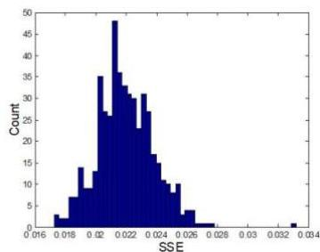

J

# DASH

## Prototype Exam

## Practical exercises

### Group I. Calculus [14.6v]

Considering the following dataset, where $y_{1} \in [0,3]$, $y_{2}$ is ordinal and $z$ is a nominal target.

|   | y_{1} | y_{2} | z  |
| --- | --- | --- | --- |
|  x_{1} | 1.2 | C | X  |
|  x_{2} | 0.2 | B | X  |
|  x_{3} | 3 | A | Y  |
|  x_{4} | 0.5 | B | Y  |
|  x_{5} | 0.3 | A | Y  |

1. [1.5v] Considering $y_{2}$ numerical encoding, {A: 0, B: 1, C: 3}, Manhattan distance, and fully unsupervised setting. Draw the dendrogram under complete linkage.

|   | x_{1} | x_{2} | x_{3} | x_{4} | x_{5}  |
| --- | --- | --- | --- | --- | --- |
|  x_{1} | 0 | 3 | 4.8 | 2.7 | 3.9  |
|  x_{2} |  | 0 | 3.8 | 0.3 | 1.1  |
|  x_{3} |  |  | 0 | 3.5 | 2.7  |
|  x_{4} |  |  |  | 0 | 1.2  |
|  x_{5} |  |  |  |  | 0  |

Dendrogram: {{{x2,x4}}[0.3], x5][1.2], x3][3.8], x1][4.8}

2. [1v] Are there multivariate outliers in accordance with DBSCAN $(p=3, \varepsilon=3)$? Which? $\{x_1, x_3\}$

3. Assuming a solution with maximal purity against the output variable $z$.

a) [1v] Identify the medoid of the larger cluster

Larger cluster $\{x_{3}, x_{4}, x_{5}\}$

Average distances $q$ to other observations in the cluster: $q(x_{3}) = 3.1, q(x_{4}) = 2.35, q(x_{5}) = 1.95$

b) [1.5v] Identify the silhouette of the smaller cluster

$$
silhouette(x_{1}) = 1 - \frac{3}{3.8} = 0.21, \quad silhouette(x_{2}) = \frac{\frac{5.2}{3}}{3} - 1 = -0.42,
$$

Note that when $a(x) &gt; b(x)$ then a better proxy to the silhouette of an observation is $\frac{b(x)}{a(x)} - 1$

$$
silhouse(c_{1}) = \frac{0.21 - 0.42}{2} = -0.1
$$

4. [1v] Consider the following analysis of sum squared errors (SSE) gathered from a thousand of randomized datasets using k-means. Identify the correct statement:

i. A SSE in [0.02,0.023] is statistically significant
ii. A SSE above 0.34 is statistically significant
iii. A SSE below 0.017 is statistically significant $\Leftarrow$
iv. None of above

