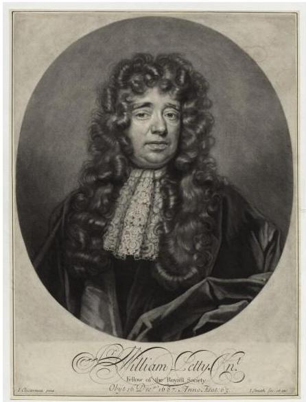

# Statistical grounds

- Machine learning as...
- the rediscovery of multivariate **statistics** from observable data (samples)
- beyond descriptive and inferential statistics
- the rediscovery of **maths** (linear algebra, calculus...)

- Exercise: associate naïve Bayes, kNN and deep learning (DL) with the aforementioned fields
- solution: NB: statistics, kNN: algebra, DL: calculus

Sir William Petty, a 17th-century economist who used early statistical methods to analyse demographic data

TÉCNICO+
FORMAÇÃO AVANÇADA