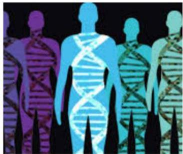

# When?

- Descriptive learning (e.g., finding associations, categories, anomalies, summaries, informative features, representations) when:
- human expertise does not exist (e.g. navigating on Mars, new cyberattacks)
- humans cannot explain their expertise (e.g. speech recognition)
- models must be customized (e.g. personalized medicine, user preferences)
- massive amounts of data (e.g. genomics, commerce, social media, web usage)

by Eric Eaton

TÉCNICO+
FORMAÇÃO AVANÇADA