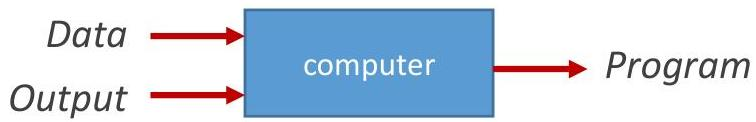
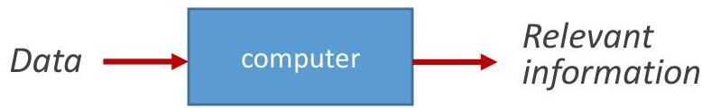

# Learning stances

- classic AI
- e.g. heuristics to play chess, drive a car, recommend products, diagnose

- supervised learning
- e.g. experience from good chess players, drivers, liked recommendations, clinical histories for decision support

- unsupervised learning
- e.g. understand decisions, detect anomalies and behavioral patterns, summarize actions

TÉCNICO+
FORMAÇÃO AVANÇADA

"Machine Learning: field of study that gives computers the ability to learn without being explicitly programmed" Arthur Samuel (1959)