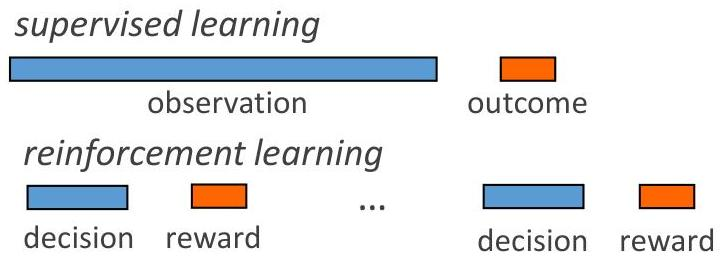

# Reinforcement learning?

- How can we have agents making decisions with little or no prior knowledge?
- trial-and-error (reinforcement learning)
+ learning from available observations
- In practice...
- conversational AI, e-mail bots, recommendations...
- adjusting predictors from ongoing pos or negative(!) feedback
- self-driving car in simulated environments
- rewards and penalties according to (un)desired risks
- optimization in industry (e.g., automation) and healthcare (e.g., therapeutics) based on ongoing pairs (protocol, outcome)

TÉCNICO+

FORMAÇÃO AVANÇADA