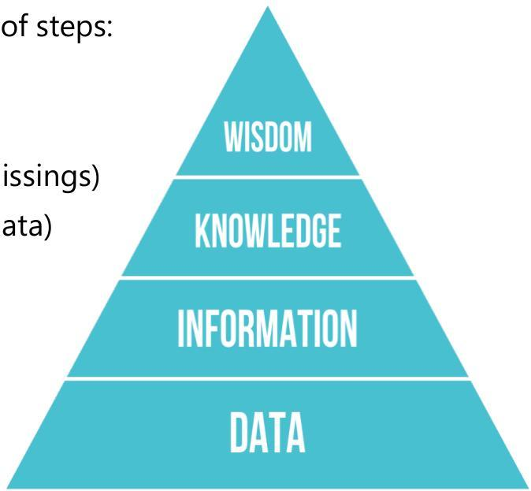

# Learning in practice

Recall: knowledge discovery from data (KDD) is a composition of steps:

- data acquisition and integration
- data preprocessing
- data cleaning (e.g. handling noise, duplicates, outliers, missings)
- data representation (e.g. extract features from complex data)
- data transformation (e.g. feature engineering, sampling, normalization, dimensionality reduction)
- data mining using machine learning
- postprocessing, explainability and knowledge acquisition from descriptive models or predictive models
- validate, consolidate and deploy discovered knowledge

TÉCNICO+
FORMAÇÃO AVANÇADA