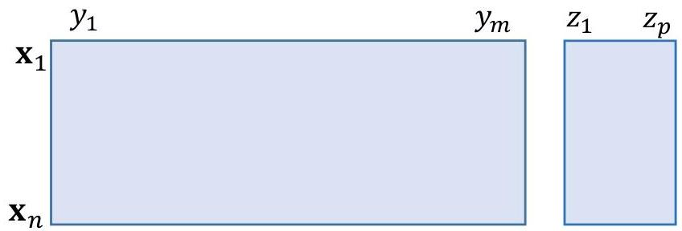

# Terminology

## Multivariate data:

- set of **observations**, $X = \{\mathbf{x}_1, \dots, \mathbf{x}_n\}$ (population)
- with values/**features** along a set of **variables**, $Y = \{y_1, \dots, y_m\}$
- **input variables** (explanatory) and optional output variables (**targets**), $Z = \{y_1, \dots, z_p\}$
- data **size** = number of observations, $|X| = n$
- data **dimensionality** = number of input variables, $|Y| = m$

TÉCNICO+
FORMAÇÃO AVANÇADA