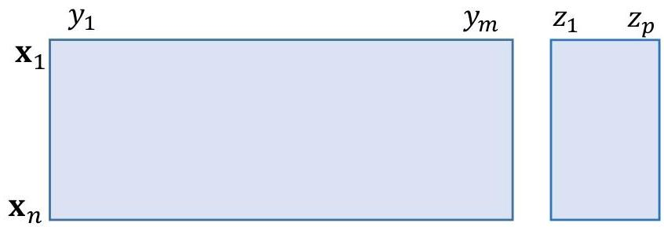

# Learning from data

Learning from data: retrieving relevant patterns
- relations/patterns/abstractions ≡ associations of interest on specific observations and variables
- unexpectedly informative
- unexpectedly discriminative (of one or more targets)
- use these relations to learn descriptors, classifiers, regressors, multi-output predictors, forecasters...

TÉCNICO+
FORMAÇÃO AVANÇADA
21