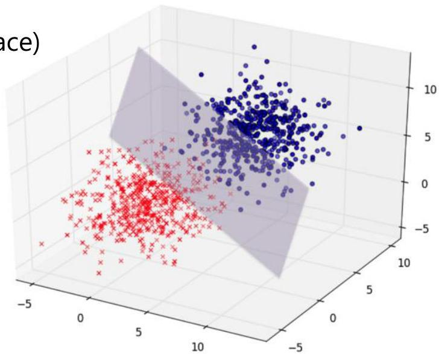

# Feature space

A set of variables (dimensions) define a space

- multivariate observations are positioned in this space
- when variables are numeric:
- feature space ≡ vector space (e.g. Euclidean space)
- observation ≡ data point

$$
\mathbf {x} = \left\{x _ {1}, \dots , x _ {m} \right\} \in \mathbb {R} ^ {m}
$$

$$
\| \mathbf {a} - \mathbf {b} \| = \sqrt {\sum_ {i = 1} ^ {m} (a _ {i} - b _ {i}) ^ {2}}
$$

TÉCNICO+

FORMAÇÃO AVANÇADA