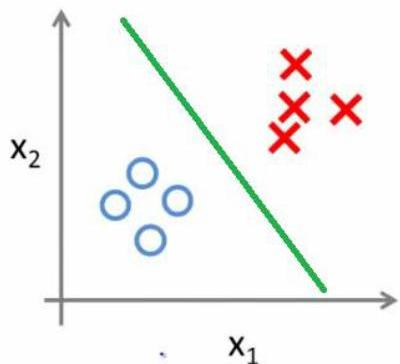
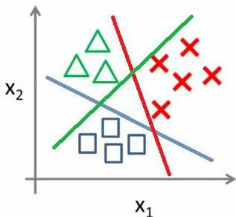

# Classification

Recall: given a set of labeled observations, $\{(x_1, z_1), \ldots, (x_n, z_n)\}$ where $z_n \in \Sigma$, a classifier $M$ is a mapping function between domain variables and a categoric variable, $M: X \to Z$

- **prediction**: given a new unlabeled observation $\mathbf{x}_{new}$, use $M$ to classify: $\hat{z}_{new} = M(x_{new})$
- **description**: inspect $M$ to acquire new knowledge

Binary classification:

Multi-class classification:

TÉCNICO+

FORMAÇÃO AVANÇADA