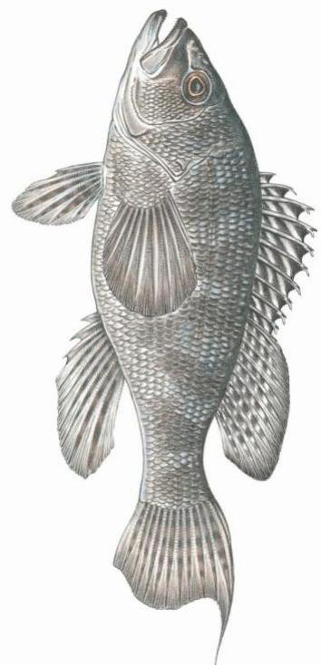
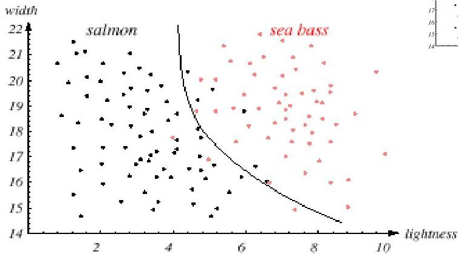

# Classification: salmon?

- width and lightness are discriminative variables
- generalization ability linked with:
- underfitting risks
- overfitting risks
- aim: find a balanced model capacity

24

TECNICO+

FORMAÇÃO AVANÇADA