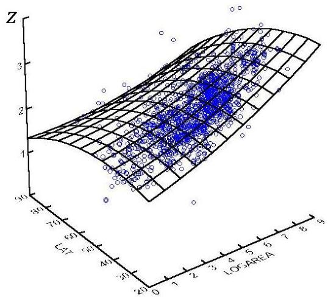

# Regression

- descriptive setting: given a set of observations, $\{(\mathbf{x}_1, z_1), \ldots, (\mathbf{x}_n, z_n)\}$ where $z_i \in \mathbb{R}$, describe the relation between a set of (explanatory) variables and a target numeric variable
- predictive setting: given a set of observations, $\{(\mathbf{x}_1,z_1),\ldots ,(\mathbf{x}_n,z_n)\}$ where $z_{i}\in \mathbb{R}$, learn a mapping, $M:X\to Z$, to estimate the outcome (quantity) of a new observation

TÉCNICO+

FORMAÇÃO AVANÇADA