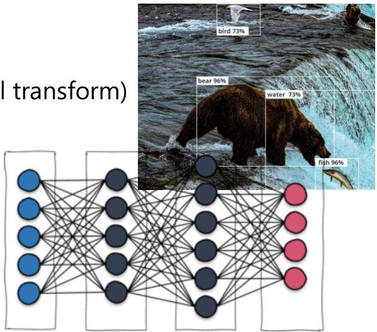

# Multi-output prediction

- Most outputs are not described by a single feature
- generative AI (e.g. question-answer, image drawing, signal transform)
- many others (e.g. self-driving vehicles, tagging content)

- Multi-output predictors, $M: X \to Z$
- predictive setting (learn predictor $M$)
- descriptive setting (explain predictor $M$)

- Special cases: multi-label classification when $\mathbf{z} \in \Sigma^{p}$ and multi-output regression when $\mathbf{z} \in \mathbb{R}^{p}$

TÉCNICO+
FORMAÇÃO AVANÇADA