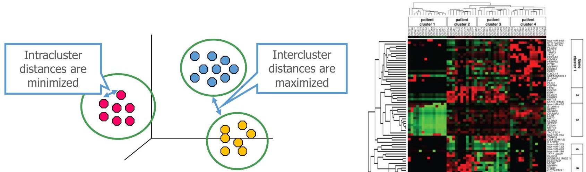

# Clustering

Given a set of data observations, $X = \{\mathbf{x}_1,\dots ,\mathbf{x}_n\}$, cluster analysis aims at grouping observations into clusters, $C_i \subseteq X$ with $i = 1..k$, according to their (dis)similarity:

- observations in the same cluster are more similar than those in different clusters

TÉCNICO+
FORMAÇÃO AVANÇADA