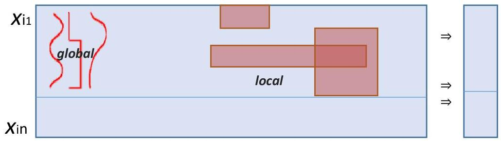

# Pattern mining

{symptomA, testB+} ⇒ condition1 [support=10%, confidence=80%, lift=1.4, p-value=1E-4]

Given a dataset, find local associations (aka patterns) satisfying:

- statistical significance criteria (min #observations to be unexpectedly frequent)
- discriminative power (qualitative targets) or correlation (numeric targets) criteria

TÉCNICO+
FORMAÇÃO AVANÇADA