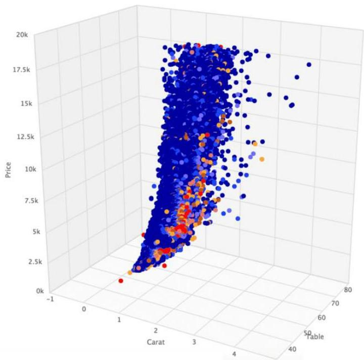

# Outlier analysis

- Understand peculiar behaviors and isolate anomalous observations
- fraud, cyberattacks, personalized health risks, adverse events, deviant social behavior, vehicle failures...

TÉCNICO+
FORMAÇÃO AVANÇADA