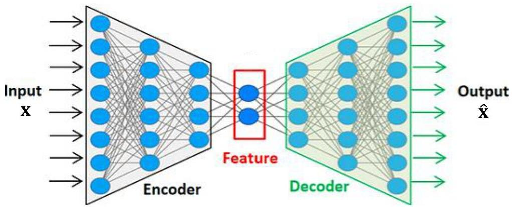

# Representation learning

Describe data using a compact set of informative (unsupervised) and/or predictive (supervised) features

- dimensionality reduction: subset of features from multivariate observations with minimal info loss
- latent feature representations of complex signals (series, image, text data) using neural networks

TÉCNICO+
FORMAÇÃO AVANÇADA