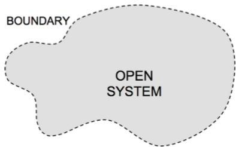

# Systemic world view

- system
- set of elements organized with a shared purpose
- (open) surrounded and influenced by its environment
- described by its structure, purpose and functioning
- open systems evolve

- Universe → galaxy → solar system
→ Earth → societies → individuals
→ organs → cells → atoms

ENVIRONMENT

TÉCNICO+
FORMAÇÃO AVANÇADA