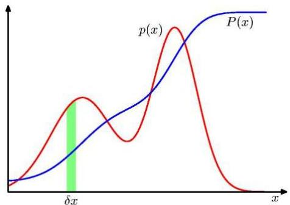

# Data profiling

- Theoretical statistics
- summary statistics: mean and deviation statistics (Gaussian assumption)
- fitting theoretical distributions
- discrete numeric variables: fitting known probability mass functions
- continuous numeric variables fitting known probability density functions
- Empirical versus theoretical distributions
- empirical distribution are perfectly overfitted to observed data
- problematic for low data sample size, otherwise preferable
- Probability versus cumulative probability functions
- former is generally preferred (yet what about "age&lt;10"?)

TÉCNICO+
FORMAÇÃO AVANÇADA