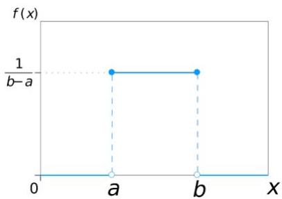
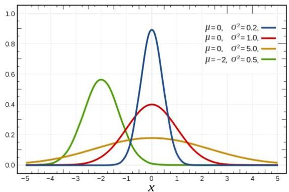
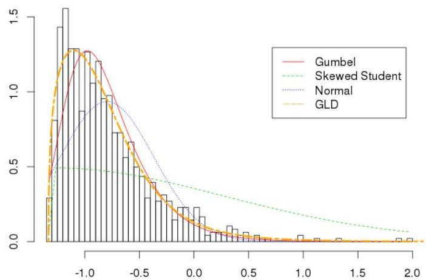

# Data profiling: fitting theoretical distributions

- Theoretical pdfs: e.g. Uniform (left), Gaussian (center)

- How to fit?
- Kolmogorov-Sminor statistical test
https://docs.scipy.org/doc/scipy/reference/generated/scipy.stats.kstest.html
- learn parameters that describe the variable

TÉCNICO+

FORMAÇÃO AVANÇADA