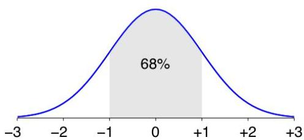
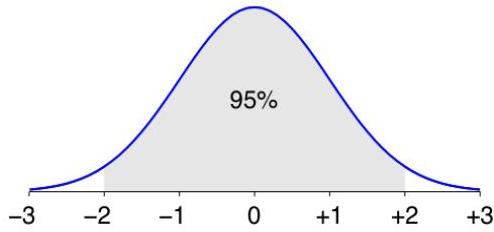
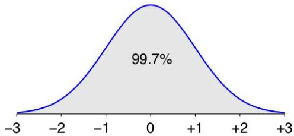

# Normal distribution

- many real-world variables are well-approximated to a Gaussian curve
- skewing is nevertheless pervasive, e.g. left skewing
- how to check if one variable satisfies the Gaussian assumption?
- use Kolmogorov-Smirnov test or, more suitably, Shapiro-Wilk test
- central limit theorem: 30 measurements often necessary to test this assumption
- interesting properties of the Normal curve:
- $\mu$–σ to $\mu$+σ contains about 68% of the measurements (μ: mean, σ: standard deviation)
- $\mu$–2σ to $\mu$+2σ contains ~95%, $\mu$–3σ to $\mu$+3σ: contains ~99.7%

TÉCNICO+

FORMAÇÃO AVANÇADA