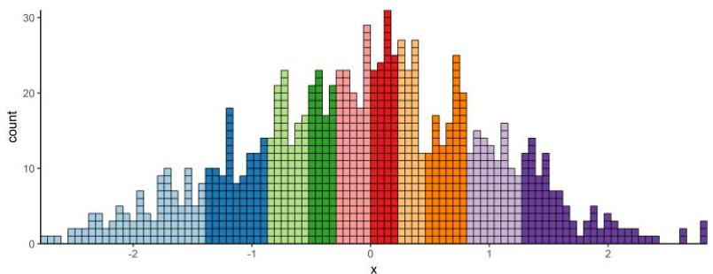

# Univariate summary statistics

- sample size: number of data observations, $n$
- percentiles
- median, maximum and minimum (50, 100 and 0 percentiles respectively)
- 5, 10, 25 (first quantile), 75 (third quantile), 90, 95 are also informative

- center statistics
- arithmetic mean (average): $\bar{\mathbf{x}} = \frac{1}{n}\sum_{i=1}^{n}x_{i}$
- median: 50 percentile, e.g. median(1,1,2,3,4,5) = 2.5
- if n is even, the median can be found by interpolating them
- mode for categorical and discrete numeric values, e.g. mode(1,2,2,3,4,4,4) = 4

TÉCNICO+ FORMACÃO AVANÇADA