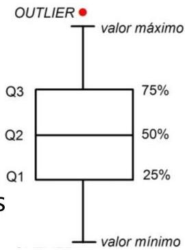

# Univariate outliers

- Univariate outlier values = uncommon values
- unexpected measurements in accordance with a variable distribution
- can cause strong effects that can wreck our interpretation of data
- numeric example: mean and variance are based on averages, hence sensitive to outliers

- Challenge: detecting outliers requires judgment and depends on one's purpose

- Any heuristic?
- interquartile range (IQR) measures value expectations
- IQR is the difference between highest value in Q3 and lowest in Q2
- quartiles(1,1,2,3,5,5,6,100) = {(1,1),(2,3),(5,5),(6,100)}, IQR 5-3=2
- observations falling outside [Q1 - 1.5 × IQR, Q3 + 1.5 × IQR] seen as outliers
- deviations falling outside $\mu \pm 2\sigma$, $\mu \pm 3\sigma$ or other user-specific criteria

TÉCNICO+
FORMAÇÃO AVANÇADA