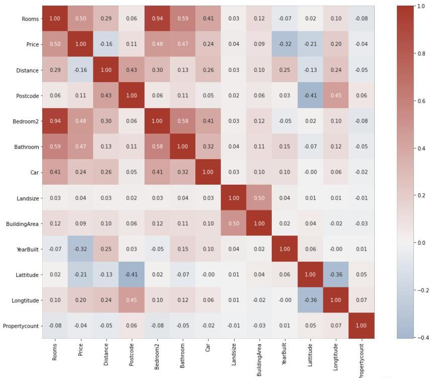

# Bivariate data statistics

Considering pairwise input variables:
- check whether two variables are strongly associated
- e.g. two highly correlated numeric variables
- if strongly associated, variables may be redundant
- e.g. select the one with higher variability

Exercise: select non-redundant variables on the provided left example

TÉCNICO+
FORMAÇÃO AVANÇADA