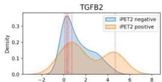
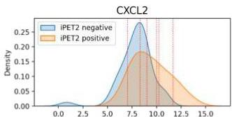
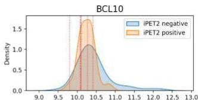
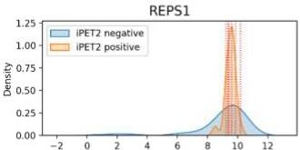
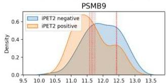
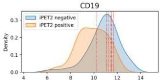
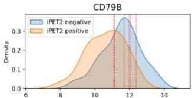
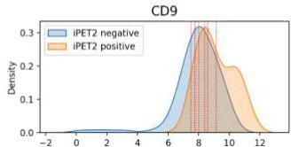
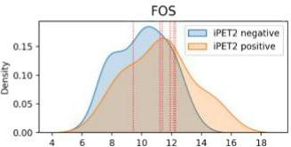

# Discriminative power

## Class-conditional distributions

- given an input variable, the higher the dissimilarity between class-condition distributions: the higher the discriminative power
- exercise: consider the following data given by 9 numeric input variables and a binary class

- Is the left data easy or hard to classify using discriminants?

TÉCNICO+

FORMAÇÃO AVANÇADA