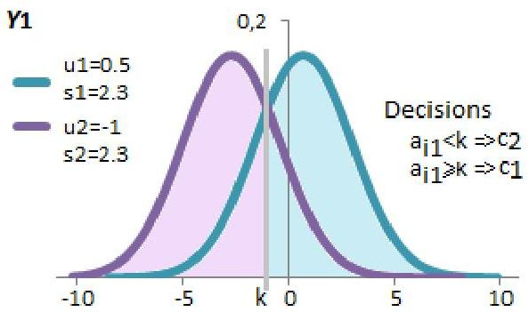
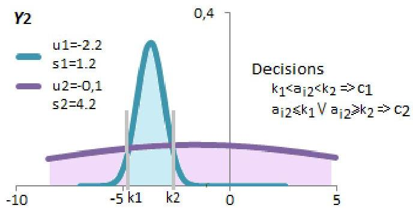

# Discriminative power

Using class-conditional distributions:

- discriminative rules can be inferred by identifying the more probable class per input value
- this classifier is termed univariate discriminant

TÉCNICO+

FORMAÇÃO AVANÇADA