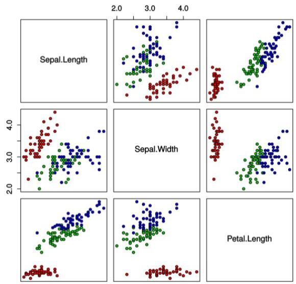
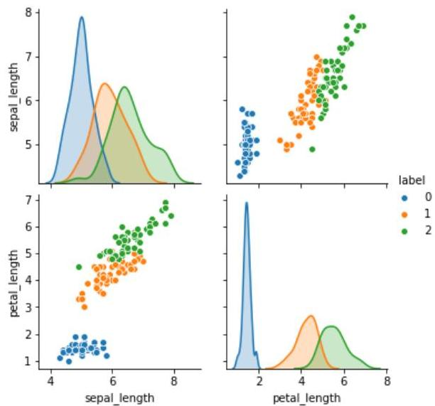

# Correlation...

- Scatter diagrams can be used to visually assess correlation
- they further provide a first look at bivariate relations to see clusters, outliers, etc.

TÉCNICO+

FORMAÇÃO AVANÇADA