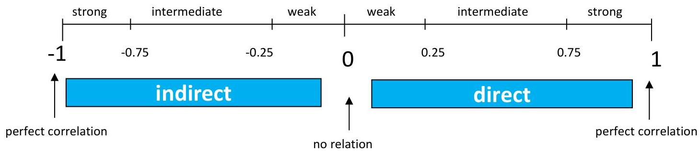

# Correlation...

Relationship between two quantitative variables

- correlation: degree to which two attributes are related (in [-1,1])
- the sign: nature of association (&gt;0 direct; &lt;0 inverse)
- the absolute value: strength of association
- unable to infer causal relationships

TÉCNICO+
FORMAÇÃO AVANÇADA