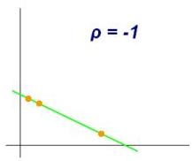
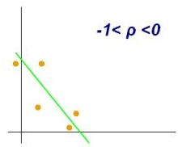
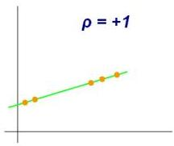
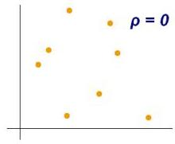
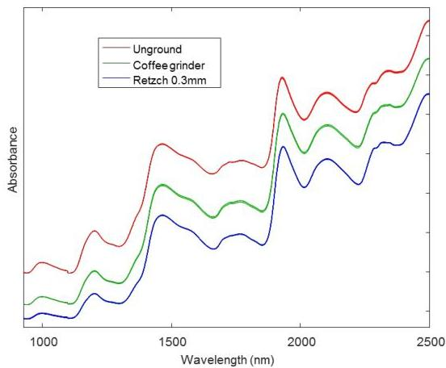

# Pearson correlation

- Linear correlation
- only suitable for numeric variables
- able to handle scales and shifts

|  Anxiety (y₁) | Test score (y₂)  |
| --- | --- |
|  10 | 2  |
|  8 | 3  |
|  2 | 9  |
|  1 | 7  |
|  5 | 6  |
|  6 | 5  |

$$
Pearson \mathbf{r} = \frac{cov(y_1, y_2)}{\sqrt{var(y_1)}\sqrt{var(y_2)}} = -0.94
$$

TÉCNICO+

FORMAÇÃO AVANÇADA