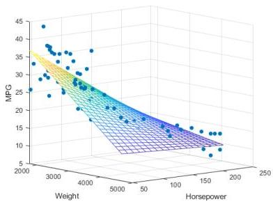

# Classical multivariate statistics

Supervised settings are informative for descriptive ends

- pervasive in scientific practice
- linear, ordinal, logistic regression models are inherently **interpretable**

$$
\hat {z} = \beta_ {0} + \beta_ {1} x _ {1} + \dots + \beta_ {m} x _ {m} + \varepsilon
$$

- coefficients indicate change (in log-odds for logistic regression) in the target when holding other inputs constant
- coefficients can be tested to assess predictive significance
- low $p$-value under F-test for linear regression or likelihood ratios for logistic/ordinal regression
- challenges: linearity, independence and normality of errors... limited efficacy
- check $R^2$ on training observations to assess proportion of variance explained
- assess residue-based scores or classification-based scores on testing observations

TÉCNICO+ FORMACÃO AVANÇADA