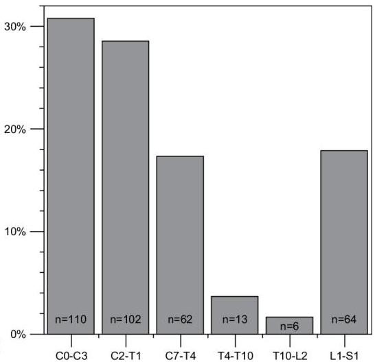

# Data profiling

- Data profiling ≡ data exploration (aka Exploratory Data Analysis)
- essential step to characterize data and guide subsequent data mining decisions

- Frequentist statistics
- categorical variables
- category frequencies
- category probabilities (probability mass function)
- numeric variables
- classic histograms: bin frequencies
- empirical probability distribution
- bin probabilities (probability mass function)
- probability density function (using for instance KDE)

TÉCNICO+
FORMAÇÃO AVANÇADA