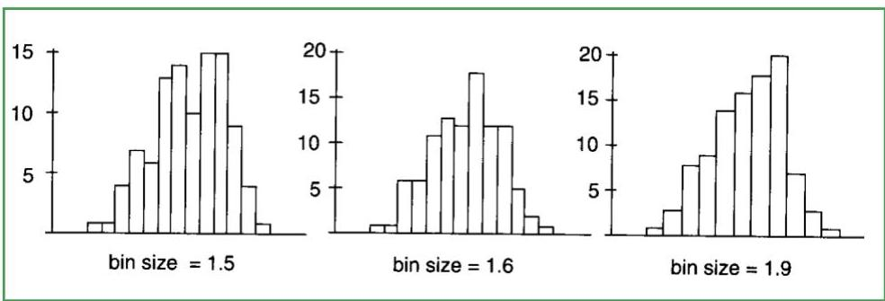
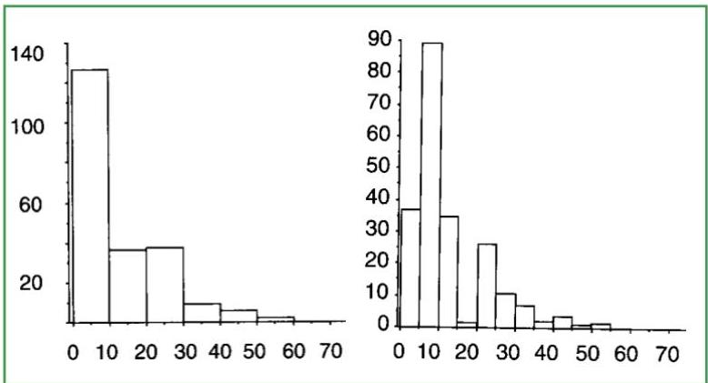

# Data profiling: histograms

- The value range of a numeric variable can be divided into several bins
- bin size can strongly affect the frequency histogram
- revealing details when we lower bin size, yet at times a result of overfitting
- bin size also affects one's perception of the shape of distribution

TÉCNICO+

FORMAÇÃO AVANÇADA