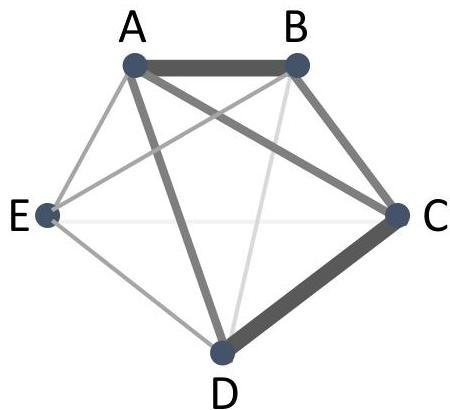
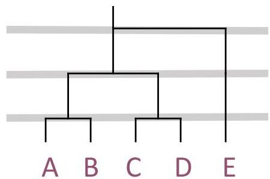

# Clustering as a graph-based task

- Proximity between all data observations defines a weighted graph
- Nodes are the observations, edges capture their distances
- Clustering = breaking the graph into connected components
- Minimize the edge weight between clusters AND maximize the edge weight within clusters
- How? Incremental grouping using thresholds

|   | A | B | C | D | E  |
| --- | --- | --- | --- | --- | --- |
|  A | 0 | 1 | 2 | 2 | 3  |
|  B | 1 | 0 | 2 | 4 | 3  |
|  C | 2 | 2 | 0 | 1 | 5  |
|  D | 2 | 4 | 1 | 0 | 3  |
|  E | 3 | 3 | 5 | 3 | 0  |

TÉCNICO+

FORMAÇÃO AVANÇADA