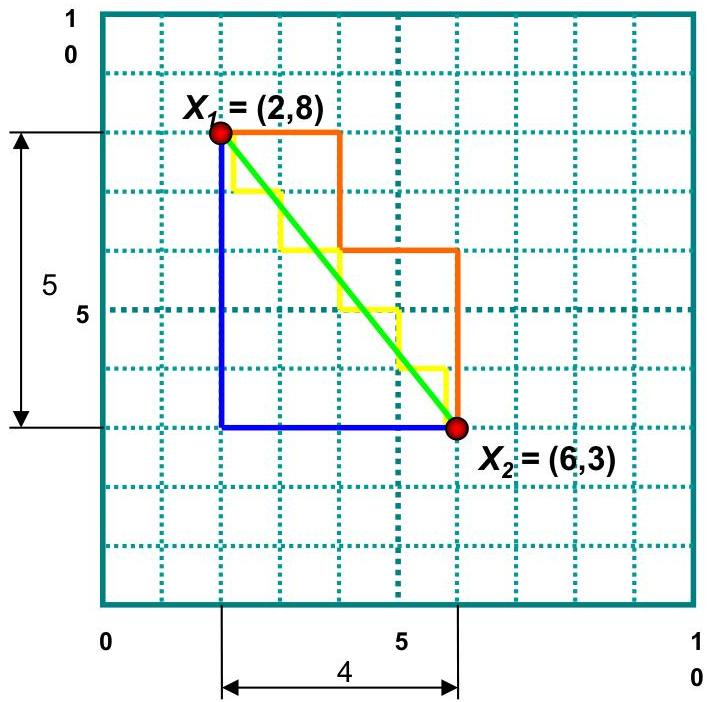

# Common distance metrics

(numeric data)

2D example

$$
x _ {1} = (2, 8)
$$

$$
x _ {2} = (6, 3)
$$

Euclidean distance

$$
d (1, 2) = \sqrt {\left| 2 - 6 \right| ^ {2} + \left| 8 - 3 \right| ^ {2}} = \sqrt {4 1}
$$

Manhattan distance

$$
d (1, 2) = | 2 - 6 | + | 8 - 3 | = 9
$$

15

TÉCNICO+

FORMAÇÃO AVANÇADA