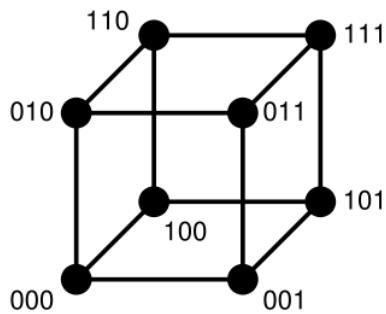
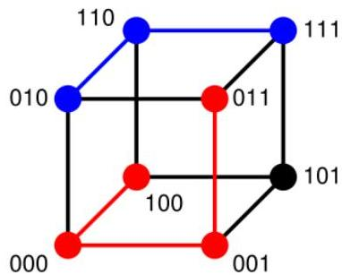

# Hamming distance

(binary and categorical data)

- number of different attribute values
- distance of (1011101) and (1001001) is 2
- distance between (toned) and (roses) is 3

3-bit binary cube

100-&gt;011 has distance 3 (red path)
010-&gt;111 has distance 2 (blue path)

TÉCNICO+
FORMAÇÃO AVANÇADA