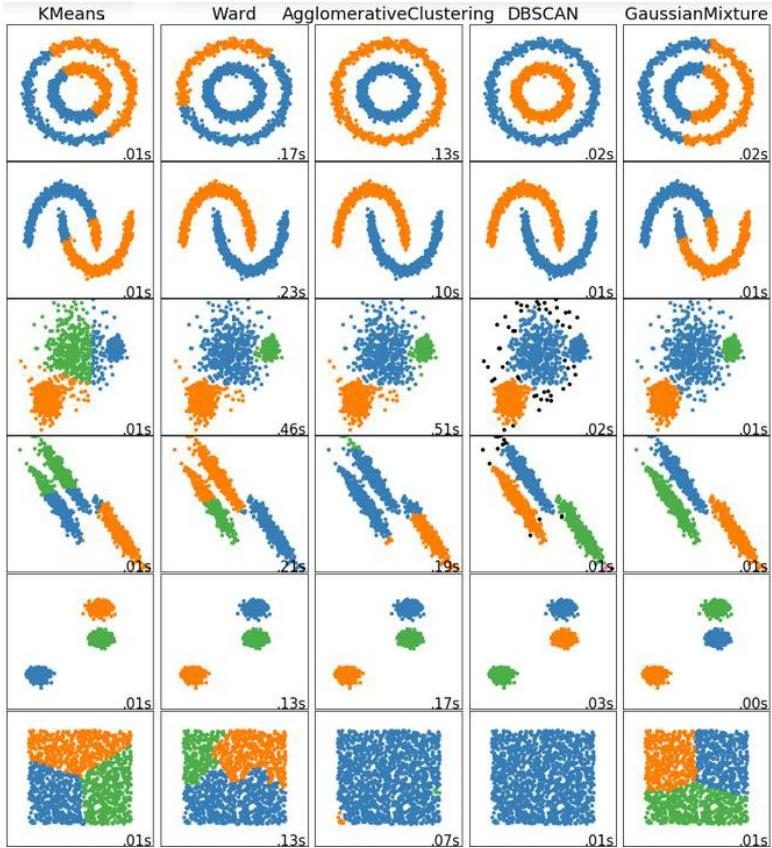

# Approaches

## Partitioning:
- Create partitions and iteratively update them (e.g. $k$-means, $k$-modes, $k$-medoids)

## Hierarchical:
- Create hierarchical decomposition of data points (e.g. Diana, Agnes)

## Density-based:
- Group points based on connectivity and density (e.g. DBSACN, DenClue)

## Model-based:
- Data are seen as a mixture of distributions (e.g. EM)

TÉCNICO+
FORMAÇÃO AVANÇADA