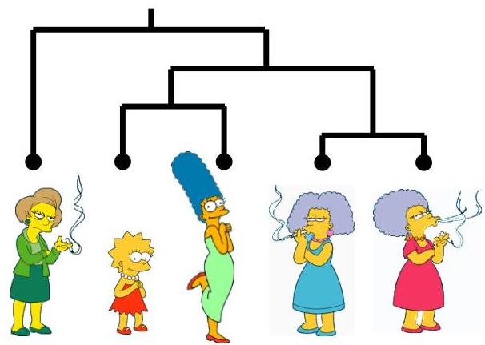

# Hierarchical clustering

The number of dendrograms with $n$ leafs $= (2n - 3)! / [(2^{(n - 2)}) (n - 2)!]$

|  Number of Leafs | Number of Possible Dendrograms  |
| --- | --- |
|  2 | 1  |
|  3 | 3  |
|  4 | 15  |
|  5 | 105  |
|  ... | ...  |
|  10 | 34,459,425  |

cannot test all possible trees
$\Rightarrow$ heuristic searches

TÉCNICO+
FORMAÇÃO AVANÇADA