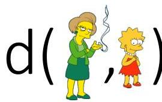
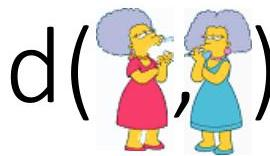

# Hierarchical clustering

- We begin with a distance matrix which contains the distances between every pair of objects in our database

$$
d(\text{} = 8
$$

$$
d(\text{} = 1
$$

|  0 | 8 | 8 | 7 | 7  |
| --- | --- | --- | --- | --- |
|   | 0 | 2 | 4 | 4  |
|   |  | 0 | 3 | 3  |
|   |  |  | 0 | 1  |
|   |  |  |  | 0  |

TÉCNICO+

FORMAÇÃO AVANÇADA