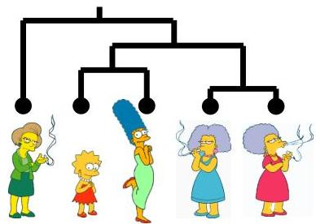
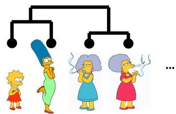
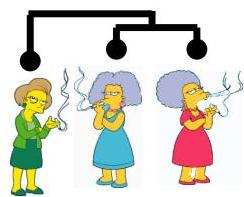
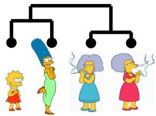
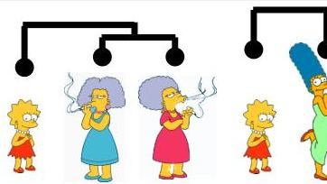
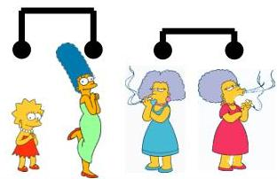
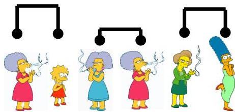

# Hierarchical clustering

Bottom-up (agglomerative)

Consider all possible merges...

Choose the best

Choose the best

Consider all possible merges...

Choose the best

Choose the best

Consider all possible merges...

Choose the best

TÉCNICO
FORMAÇÃO ALGÃO
33