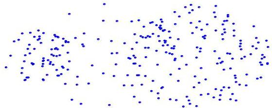
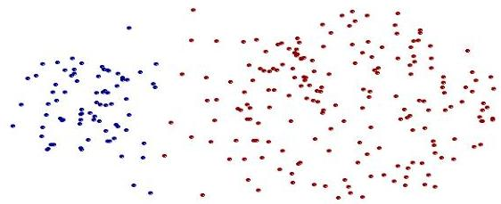
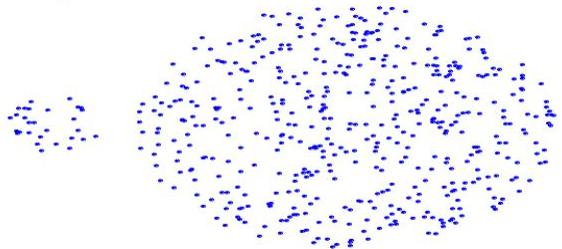
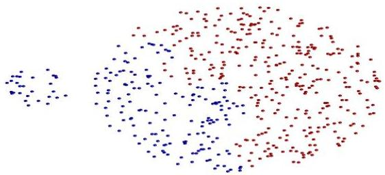

# MAX: strengths and limitations

- Less susceptible to noise and outliers

original points

clusters

- Tends to break large clusters
- Biased towards globular clusters

original points

clusters

TÉCNICO+
FORMAÇÃO AVANÇADA